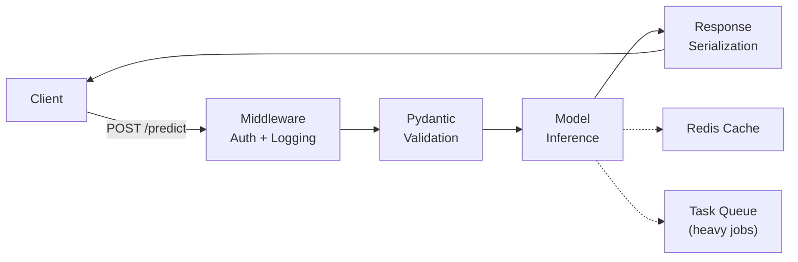

# 🚀 API Design — FastAPI cho AI

> **Mục tiêu**: REST API, FastAPI, Pydantic validation, error handling, async.

---

## 0. AI API Request Flow



---

## 1. FastAPI Basics

```python
from fastapi import FastAPI, HTTPException
from pydantic import BaseModel, Field
import uvicorn

app = FastAPI(
    title="AI Model API",
    description="Production ML Model Serving",
    version="1.0.0",
)

# --- Request/Response Models ---
class PredictionRequest(BaseModel):
    text: str = Field(..., min_length=1, max_length=10000, description="Input text")
    model: str = Field(default="gpt-4o-mini", description="Model to use")
    temperature: float = Field(default=0.7, ge=0.0, le=2.0)
    max_tokens: int = Field(default=1000, ge=1, le=4096)
    
    model_config = {"json_schema_extra": {
        "example": {
            "text": "Explain machine learning",
            "model": "gpt-4o-mini",
            "temperature": 0.7,
            "max_tokens": 1000,
        }
    }}

class PredictionResponse(BaseModel):
    text: str
    model: str
    usage: dict
    latency_ms: float

# --- Endpoints ---
@app.get("/health")
async def health():
    return {"status": "healthy", "model_loaded": True}

@app.post("/predict", response_model=PredictionResponse)
async def predict(request: PredictionRequest):
    import time
    start = time.time()
    
    # Model inference
    result = await run_inference(request.text, request.model)
    
    latency = (time.time() - start) * 1000
    return PredictionResponse(
        text=result,
        model=request.model,
        usage={"prompt_tokens": len(request.text.split()), "completion_tokens": 50},
        latency_ms=round(latency, 1),
    )

@app.post("/chat")
async def chat(messages: list[dict]):
    """Chat completion endpoint."""
    # Validate messages
    for msg in messages:
        if "role" not in msg or "content" not in msg:
            raise HTTPException(400, "Each message must have 'role' and 'content'")
        if msg["role"] not in ["system", "user", "assistant"]:
            raise HTTPException(400, f"Invalid role: {msg['role']}")
    
    response = await generate_chat(messages)
    return {"message": response, "model": "gpt-4o-mini"}
```

---

## 2. Middleware & Error Handling

```python
from fastapi import Request
from fastapi.responses import JSONResponse
import time
import logging

logger = logging.getLogger(__name__)

# Request timing middleware
@app.middleware("http")
async def add_timing(request: Request, call_next):
    start = time.time()
    response = await call_next(request)
    duration = (time.time() - start) * 1000
    response.headers["X-Process-Time-Ms"] = str(round(duration, 1))
    logger.info(f"{request.method} {request.url.path} → {response.status_code} ({duration:.1f}ms)")
    return response

# Global error handler
@app.exception_handler(Exception)
async def global_exception_handler(request: Request, exc: Exception):
    logger.error(f"Unhandled error: {exc}", exc_info=True)
    return JSONResponse(
        status_code=500,
        content={"error": "Internal server error", "detail": str(exc)},
    )

# Model-specific errors
class ModelNotLoadedError(Exception):
    pass

@app.exception_handler(ModelNotLoadedError)
async def model_error_handler(request: Request, exc: ModelNotLoadedError):
    return JSONResponse(status_code=503, content={"error": "Model not available"})
```

---

## 3. File Upload & Batch Processing

```python
from fastapi import UploadFile, File, BackgroundTasks

@app.post("/upload")
async def upload_document(
    file: UploadFile = File(...),
    background_tasks: BackgroundTasks = None,
):
    # Validate file type
    allowed = {"pdf", "txt", "md", "docx"}
    ext = file.filename.split(".")[-1].lower()
    if ext not in allowed:
        raise HTTPException(400, f"File type .{ext} not supported")
    
    # Validate size (10MB max)
    content = await file.read()
    if len(content) > 10 * 1024 * 1024:
        raise HTTPException(400, "File too large (max 10MB)")
    
    # Process in background
    job_id = generate_job_id()
    background_tasks.add_task(process_document, job_id, content, ext)
    
    return {"job_id": job_id, "status": "processing", "filename": file.filename}

@app.get("/jobs/{job_id}")
async def get_job_status(job_id: str):
    status = get_job(job_id)
    if not status:
        raise HTTPException(404, "Job not found")
    return status
---

## 4. Dependency Injection

```python
# Centralize shared dependencies (DB, model, config)

from functools import lru_cache
from fastapi import Depends
from pydantic_settings import BaseSettings

class Settings(BaseSettings):
    openai_api_key: str
    model_name: str = "gpt-4o-mini"
    max_tokens: int = 4096
    redis_url: str = "redis://localhost:6379"
    
    class Config:
        env_file = ".env"

@lru_cache()
def get_settings() -> Settings:
    return Settings()

# ML Model dependency
class ModelService:
    def __init__(self, settings: Settings):
        self.model = self._load_model(settings.model_name)
    
    def _load_model(self, name: str):
        # Load on startup, reuse across requests
        return {"name": name, "loaded": True}
    
    async def predict(self, text: str) -> str:
        return f"Prediction from {self.model['name']}"

_model_service = None

def get_model_service(settings: Settings = Depends(get_settings)) -> ModelService:
    global _model_service
    if _model_service is None:
        _model_service = ModelService(settings)
    return _model_service

# Usage in endpoint
@app.post("/predict")
async def predict(
    request: PredictionRequest,
    model: ModelService = Depends(get_model_service),
    settings: Settings = Depends(get_settings),
):
    result = await model.predict(request.text)
    return {"result": result, "model": settings.model_name}
```

---

## 5. Pagination & Cursor-based Patterns

```python
from pydantic import BaseModel, Field
from datetime import datetime

# Cursor-based pagination (better for real-time data)
class PaginationParams(BaseModel):
    cursor: str | None = None         # Opaque cursor (base64 encoded ID)
    limit: int = Field(default=20, ge=1, le=100)

class PaginatedResponse(BaseModel):
    items: list[dict]
    next_cursor: str | None = None
    has_more: bool = False
    total_count: int | None = None    # Optional: expensive for large tables

@app.get("/conversations")
async def list_conversations(
    cursor: str | None = None,
    limit: int = 20,
):
    """Cursor-based pagination — stable across insertions/deletions."""
    import base64
    
    query = "SELECT * FROM conversations WHERE user_id = :uid"
    
    if cursor:
        # Decode cursor → last seen ID
        last_id = base64.b64decode(cursor).decode()
        query += f" AND id < :last_id"
    
    query += " ORDER BY created_at DESC LIMIT :limit"
    
    results = await db.fetch_all(query, {"uid": user_id, "last_id": last_id, "limit": limit + 1})
    
    has_more = len(results) > limit
    items = results[:limit]
    
    next_cursor = None
    if has_more:
        next_cursor = base64.b64encode(str(items[-1]["id"]).encode()).decode()
    
    return PaginatedResponse(
        items=items,
        next_cursor=next_cursor,
        has_more=has_more,
    )

# Why cursor > offset?
# - Offset: skip(1000) is slow, inconsistent with new inserts
# - Cursor: O(1) via index, stable pagination
```

---

## 6. CORS & Security Headers

```python
from fastapi.middleware.cors import CORSMiddleware

# CORS — careful with wildcards in production
app.add_middleware(
    CORSMiddleware,
    allow_origins=[
        "https://myapp.com",
        "https://staging.myapp.com",
        "http://localhost:3000",      # Dev only
    ],
    allow_credentials=True,
    allow_methods=["GET", "POST", "PUT", "DELETE"],
    allow_headers=["*"],
    expose_headers=["X-Process-Time-Ms"],
)

# Security headers middleware
@app.middleware("http")
async def add_security_headers(request: Request, call_next):
    response = await call_next(request)
    response.headers["X-Content-Type-Options"] = "nosniff"
    response.headers["X-Frame-Options"] = "DENY"
    response.headers["Strict-Transport-Security"] = "max-age=31536000; includeSubDomains"
    return response
```

---

## 7. Rate Limiting Middleware

```python
from collections import defaultdict
from time import time
from fastapi import Request, HTTPException

class RateLimitMiddleware:
    """Sliding window rate limiter per client IP."""
    
    def __init__(self, max_requests: int = 60, window: int = 60):
        self.max_requests = max_requests
        self.window = window
        self.clients: dict[str, list[float]] = defaultdict(list)
    
    async def __call__(self, request: Request, call_next):
        client_ip = request.client.host
        now = time()
        
        # Clean expired timestamps
        self.clients[client_ip] = [
            t for t in self.clients[client_ip] 
            if t > now - self.window
        ]
        
        if len(self.clients[client_ip]) >= self.max_requests:
            return JSONResponse(
                status_code=429,
                content={"error": "Rate limit exceeded", "retry_after": self.window},
                headers={"Retry-After": str(self.window)},
            )
        
        self.clients[client_ip].append(now)
        response = await call_next(request)
        
        # Add rate limit headers
        remaining = self.max_requests - len(self.clients[client_ip])
        response.headers["X-RateLimit-Limit"] = str(self.max_requests)
        response.headers["X-RateLimit-Remaining"] = str(remaining)
        return response

# Register
app.add_middleware(RateLimitMiddleware, max_requests=100, window=60)
```

---

## 🎯 Interview Tips — Chi Tiết

### Q1: "FastAPI vs Flask?"
**A**: FastAPI: async native, auto-docs (Swagger/ReDoc), Pydantic validation, 2-3x faster (Starlette + uvicorn). Flask: simpler, larger ecosystem, more tutorials. AI/ML production apps → FastAPI.

### Q2: "Pydantic validation?"
**A**: Type safety ở cả request và response. Auto validation (min/max, regex, custom validators). Auto-generate OpenAPI schema → interactive docs.

### Q3: "Background tasks vs task queue?"
**A**: `BackgroundTasks`: simple, in-process, no extra infra. Good for <30s tasks. Task Queue (Celery, Cloud Tasks): distributed, persistent, retries. Good for >30s tasks.

### Q4: "API versioning strategy?"
**A**: URL prefix: `/v1/predict`, `/v2/predict` (most common, clear). Header: `Accept: application/vnd.api+json;version=2`. Always version ML APIs.

### Q5: "Request/Response design for ML?"
**A**: Request: `text`, `model`, `temperature`, `max_tokens` — all with Pydantic constraints. Response: `result`, `model`, `usage` (tokens), `latency_ms`.

### Q6: "Error handling patterns?"
**A**: (1) Pydantic auto-validates → 422. (2) Business logic → `HTTPException(400)`. (3) Model errors → 503. (4) Global handler → 500 + log.

### Q7: "Cursor vs offset pagination?"
**A**: Cursor: O(1) via index, stable across inserts/deletes. Offset: simple but slow for large tables (OFFSET 10000 = scan 10000 rows). Chat apps = cursor always.

### Q8: "Dependency Injection trong FastAPI?"
**A**: `Depends()` cho DB sessions, model instances, settings. Lifetime: `@lru_cache` cho singleton, generator cho per-request (DB session). Testability: override dependencies in tests.
