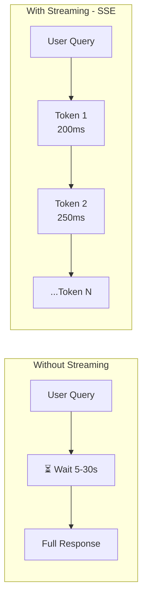

# 📡 Streaming & SSE — Production Guide

> **Mục tiêu**: SSE, WebSocket, OpenAI-compatible streaming, error handling, cancellation.
> Streaming = "token-by-token" response. Users nhanh hơn, engagement cao hơn.

---

## 1. Streaming tại sao quan trọng?



> **Impact**: Streaming reduces perceived latency by **80-90%**. TTFT: 200-500ms vs 5-30s.

---

## 2. Server-Sent Events (SSE)

### 2.1 Backend — FastAPI SSE

```python
from fastapi import FastAPI, Request
from fastapi.responses import StreamingResponse
import asyncio
import json
from openai import AsyncOpenAI

app = FastAPI()
client = AsyncOpenAI()

async def stream_openai(prompt: str, model: str = "gpt-4o-mini"):
    """Stream from OpenAI API → SSE format."""
    response = await client.chat.completions.create(
        model=model,
        messages=[{"role": "user", "content": prompt}],
        stream=True,
        max_tokens=2048,
    )
    
    async for chunk in response:
        if chunk.choices[0].delta.content:
            token = chunk.choices[0].delta.content
            data = {"choices": [{"delta": {"content": token}}]}
            yield f"data: {json.dumps(data)}\n\n"
    
    yield "data: [DONE]\n\n"

@app.post("/chat/stream")
async def chat_stream(request: dict):
    return StreamingResponse(
        stream_openai(request.get("prompt", "")),
        media_type="text/event-stream",
        headers={
            "Cache-Control": "no-cache",
            "Connection": "keep-alive",
            "X-Accel-Buffering": "no",     # Nginx: disable buffering
            "Content-Type": "text/event-stream",
        },
    )
```

### 2.2 Frontend — JavaScript Consumer

```javascript
// ── Method 1: fetch + ReadableStream (recommended) ──
async function streamChat(prompt) {
    const outputEl = document.getElementById('output');
    outputEl.textContent = '';
    
    const response = await fetch('/chat/stream', {
        method: 'POST',
        headers: {'Content-Type': 'application/json'},
        body: JSON.stringify({prompt}),
    });
    
    const reader = response.body.getReader();
    const decoder = new TextDecoder();
    let buffer = '';
    
    while (true) {
        const {done, value} = await reader.read();
        if (done) break;
        
        buffer += decoder.decode(value, {stream: true});
        
        // Process complete SSE messages
        const lines = buffer.split('\n');
        buffer = lines.pop(); // Keep incomplete line
        
        for (const line of lines) {
            if (!line.startsWith('data: ')) continue;
            const data = line.slice(6);
            if (data === '[DONE]') return;
            
            try {
                const parsed = JSON.parse(data);
                const token = parsed.choices[0]?.delta?.content || '';
                outputEl.textContent += token;
            } catch (e) {
                // Skip invalid JSON
            }
        }
    }
}

// ── Method 2: EventSource (simpler, GET only) ──
const eventSource = new EventSource('/stream?prompt=hello');
eventSource.onmessage = (event) => {
    if (event.data === '[DONE]') {
        eventSource.close();
        return;
    }
    const data = JSON.parse(event.data);
    document.getElementById('output').textContent += data.choices[0].delta.content;
};
eventSource.onerror = () => eventSource.close();
```

### 2.3 React Hook for Streaming

```typescript
import { useState, useCallback, useRef } from 'react';

interface UseStreamOptions {
    url: string;
    onToken?: (token: string) => void;
    onDone?: (fullText: string) => void;
    onError?: (error: Error) => void;
}

function useStream({ url, onToken, onDone, onError }: UseStreamOptions) {
    const [isStreaming, setIsStreaming] = useState(false);
    const [text, setText] = useState('');
    const abortRef = useRef<AbortController | null>(null);
    
    const start = useCallback(async (prompt: string) => {
        setIsStreaming(true);
        setText('');
        let fullText = '';
        
        abortRef.current = new AbortController();
        
        try {
            const res = await fetch(url, {
                method: 'POST',
                headers: {'Content-Type': 'application/json'},
                body: JSON.stringify({ prompt }),
                signal: abortRef.current.signal,
            });
            
            const reader = res.body!.getReader();
            const decoder = new TextDecoder();
            let buffer = '';
            
            while (true) {
                const { done, value } = await reader.read();
                if (done) break;
                
                buffer += decoder.decode(value, { stream: true });
                const lines = buffer.split('\n');
                buffer = lines.pop()!;
                
                for (const line of lines) {
                    if (!line.startsWith('data: ')) continue;
                    const data = line.slice(6);
                    if (data === '[DONE]') break;
                    
                    try {
                        const parsed = JSON.parse(data);
                        const token = parsed.choices[0]?.delta?.content || '';
                        fullText += token;
                        setText(fullText);
                        onToken?.(token);
                    } catch {}
                }
            }
            
            onDone?.(fullText);
        } catch (err: any) {
            if (err.name !== 'AbortError') onError?.(err);
        } finally {
            setIsStreaming(false);
        }
    }, [url, onToken, onDone, onError]);
    
    const cancel = useCallback(() => {
        abortRef.current?.abort();
        setIsStreaming(false);
    }, []);
    
    return { text, isStreaming, start, cancel };
}

// Usage:
// const { text, isStreaming, start, cancel } = useStream({
//     url: '/api/chat/stream',
//     onDone: (full) => saveMessage(full),
// });
```

---

## 3. WebSocket Chat

```python
from fastapi import WebSocket, WebSocketDisconnect
from typing import Dict
import uuid

class ConnectionManager:
    """Manage WebSocket connections per user."""
    def __init__(self):
        self.active: Dict[str, WebSocket] = {}
    
    async def connect(self, ws: WebSocket, client_id: str):
        await ws.accept()
        self.active[client_id] = ws
    
    def disconnect(self, client_id: str):
        self.active.pop(client_id, None)
    
    async def send(self, client_id: str, message: dict):
        if client_id in self.active:
            await self.active[client_id].send_json(message)

manager = ConnectionManager()

@app.websocket("/ws/chat/{client_id}")
async def websocket_chat(ws: WebSocket, client_id: str):
    await manager.connect(ws, client_id)
    
    try:
        while True:
            data = await ws.receive_json()
            msg_id = str(uuid.uuid4())
            
            # Start streaming
            await manager.send(client_id, {
                "type": "start", "id": msg_id
            })
            
            # Stream tokens
            full_response = ""
            async for token in stream_openai_tokens(data["message"]):
                full_response += token
                await manager.send(client_id, {
                    "type": "token",
                    "id": msg_id,
                    "content": token,
                })
            
            # Done
            await manager.send(client_id, {
                "type": "end",
                "id": msg_id,
                "full_content": full_response,
            })
    
    except WebSocketDisconnect:
        manager.disconnect(client_id)
```

---

## 4. SSE vs WebSocket vs Long Polling

| Feature | SSE | WebSocket | Long Polling |
|---------|-----|-----------|-------------|
| **Direction** | Server → Client | Bidirectional | Client → Server |
| **Protocol** | HTTP | WS (upgrade) | HTTP |
| **Reconnect** | Auto-reconnect ✅ | Manual ❌ | Automatic |
| **Complexity** | Simple | Complex | Simple |
| **Proxy/CDN** | Sometimes issues | Often blocked | Works everywhere |
| **Binary data** | ❌ Text only | ✅ Binary + text | ❌ Text |
| **AI chat** | ✅ **Best default** | Voice/real-time | Legacy fallback |

### Decision Guide
```
AI chat (text) → SSE (simple, reliable, auto-reconnect)
Voice/realtime  → WebSocket (bidirectional audio streaming)
Notifications   → SSE (server push, auto-reconnect)
Multiplayer     → WebSocket (low latency, bidirectional)
Fallback        → Long Polling (behind strict corporate proxies)
```

---

## 5. Production Considerations

### 5.1 Cancellation & Timeout

```python
@app.post("/chat/stream")
async def chat_stream(request: Request, body: dict):
    """Stream with cancellation support."""
    
    async def stream_with_cancel():
        try:
            async for chunk in stream_openai(body["prompt"]):
                # Check if client disconnected
                if await request.is_disconnected():
                    print("Client disconnected — stopping generation")
                    break  # Stop generating (save cost!)
                yield chunk
        except asyncio.CancelledError:
            print("Stream cancelled")
    
    return StreamingResponse(
        stream_with_cancel(),
        media_type="text/event-stream",
    )
```

### 5.2 Error Handling in Stream

```python
async def resilient_stream(prompt: str):
    """Stream with error handling."""
    try:
        async for chunk in stream_openai(prompt):
            yield chunk
    except Exception as e:
        # Send error as SSE event
        error_data = {"error": str(e), "type": type(e).__name__}
        yield f"event: error\ndata: {json.dumps(error_data)}\n\n"
    finally:
        yield "data: [DONE]\n\n"
```

### 5.3 Rate Limiting for Streams

```python
from collections import defaultdict
import time

class StreamRateLimiter:
    def __init__(self, max_concurrent: int = 5, max_per_minute: int = 20):
        self.max_concurrent = max_concurrent
        self.max_per_minute = max_per_minute
        self.active: dict[str, int] = defaultdict(int)
        self.history: dict[str, list] = defaultdict(list)
    
    def can_stream(self, user_id: str) -> bool:
        # Check concurrent streams
        if self.active[user_id] >= self.max_concurrent:
            return False
        
        # Check rate limit
        now = time.time()
        recent = [t for t in self.history[user_id] if now - t < 60]
        self.history[user_id] = recent
        
        return len(recent) < self.max_per_minute
```

---

## 6. Streaming Edge Cases

```typescript
// ── 1. Partial JSON in Stream ──
// Problem: tool_call arguments arrive as fragments
function parseStreamingJSON(buffer: string): object | null {
  try {
    return JSON.parse(buffer);
  } catch {
    return null; // Wait for more data
  }
}

// ── 2. Connection Drops + Auto-Retry ──
function createRobustEventSource(url: string, maxRetries = 3) {
  let retries = 0;
  let backoff = 1000;
  
  function connect() {
    const source = new EventSource(url);
    
    source.onopen = () => { retries = 0; backoff = 1000; };
    
    source.onerror = () => {
      source.close();
      if (retries < maxRetries) {
        retries++;
        setTimeout(connect, backoff);
        backoff *= 2; // Exponential backoff
      }
    };
    
    return source;
  }
  
  return connect();
}

// ── 3. Cancel Stream (AbortController) ──
const controller = new AbortController();

fetch('/api/chat', {
  method: 'POST',
  body: JSON.stringify({ message: 'Hello' }),
  signal: controller.signal, // ← Pass abort signal
});

// User clicks "Stop generating"
document.getElementById('stop-btn')?.addEventListener('click', () => {
  controller.abort(); // Immediately cancels the fetch
});

// ── 4. Tool Calls Mid-Stream ──
// Handle special events during streaming
eventSource.onmessage = (event) => {
  const data = JSON.parse(event.data);
  
  switch (data.type) {
    case 'text':
      appendToMessage(data.content);      // Normal text token
      break;
    case 'tool_start':
      showToolIndicator(data.tool_name);   // "Searching..."
      break;
    case 'tool_result':
      hideToolIndicator();
      appendToolResult(data.result);       // Show tool output
      break;
    case 'done':
      finalizeMessage();
      break;
  }
};
```

---

## 🎯 Interview Tips — Chi Tiết

### Q1: "SSE vs WebSocket cho AI chat?"
**A**: SSE: simpler, auto-reconnect, HTTP-based, works through most proxies/CDNs. WebSocket: bidirectional, better for voice/real-time. **90% of AI chat apps use SSE** (including ChatGPT, Claude).

### Q2: "Streaming implementation architecture?"
**A**: Backend: `async generator` yields SSE events (`data: {json}\n\n`). Frontend: `fetch` + `ReadableStream` reader. Format: OpenAI-compatible `data: {"choices":[{"delta":{"content":"token"}}]}\n\n`. End signal: `data: [DONE]\n\n`.

### Q3: "Buffering issues?"
**A**: Nginx, CDN, reverse proxies may buffer SSE. Fix: `X-Accel-Buffering: no`, `Cache-Control: no-cache`, `proxy_buffering off` (nginx). Test end-to-end in production environment.

### Q4: "Client disconnection?"
**A**: Critical for cost! If user navigates away, stop LLM generation. FastAPI: `request.is_disconnected()`. Frontend: `AbortController.abort()`. Save tokens = save money.

### Q5: "TTFT (Time To First Token)?"
**A**: Key metric for perceived performance. Target: <500ms. Factors: network latency, model loading, prompt processing. Optimize: keep model warm, minimize prompt, use faster model for first response.

### Q6: "Streaming error handling?"
**A**: Send errors as SSE events: `event: error\ndata: {"message": "..."}\n\n`. Frontend: detect error event type, show user-friendly message. Always send `[DONE]` even on error.
