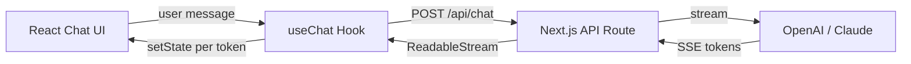

# ⚛️ Frontend cho AI Apps

> **Mục tiêu**: React/Next.js, Chat UI, Streaming display, Markdown rendering.

---

## 0. Chat UI Architecture



---

## 1. Chat UI Component (React)

```tsx
// components/ChatMessage.tsx
interface Message {
  id: string;
  role: 'user' | 'assistant';
  content: string;
  timestamp: Date;
  isStreaming?: boolean;
}

function ChatMessage({ message }: { message: Message }) {
  return (
    <div className={`message ${message.role}`}>
      <div className="avatar">
        {message.role === 'user' ? '👤' : '🤖'}
      </div>
      <div className="content">
        <ReactMarkdown>{message.content}</ReactMarkdown>
        {message.isStreaming && <span className="cursor">▊</span>}
      </div>
    </div>
  );
}
```

---

## 2. Streaming Chat Hook

```tsx
// hooks/useChat.ts
function useChat() {
  const [messages, setMessages] = useState<Message[]>([]);
  const [isLoading, setIsLoading] = useState(false);

  const sendMessage = async (content: string) => {
    // Add user message
    const userMsg = { id: uuid(), role: 'user', content, timestamp: new Date() };
    setMessages(prev => [...prev, userMsg]);
    
    // Create assistant placeholder
    const assistantId = uuid();
    setMessages(prev => [...prev, {
      id: assistantId, role: 'assistant', content: '', 
      timestamp: new Date(), isStreaming: true,
    }]);
    
    setIsLoading(true);

    // Stream response via SSE
    const response = await fetch('/api/chat', {
      method: 'POST',
      headers: { 'Content-Type': 'application/json' },
      body: JSON.stringify({ messages: [...messages, userMsg] }),
    });

    const reader = response.body.getReader();
    const decoder = new TextDecoder();

    while (true) {
      const { done, value } = await reader.read();
      if (done) break;

      const chunk = decoder.decode(value);
      const lines = chunk.split('\n').filter(l => l.startsWith('data: '));

      for (const line of lines) {
        const data = line.slice(6);
        if (data === '[DONE]') break;
        
        const parsed = JSON.parse(data);
        const token = parsed.choices[0].delta.content || '';
        
        // Append token to assistant message
        setMessages(prev => prev.map(m => 
          m.id === assistantId
            ? { ...m, content: m.content + token }
            : m
        ));
      }
    }

    // Mark streaming complete
    setMessages(prev => prev.map(m =>
      m.id === assistantId ? { ...m, isStreaming: false } : m
    ));
    setIsLoading(false);
  };

  return { messages, sendMessage, isLoading };
}
```

---

## 3. Next.js API Route

```tsx
// app/api/chat/route.ts
import { NextRequest } from 'next/server';
import OpenAI from 'openai';

const openai = new OpenAI();

export async function POST(req: NextRequest) {
  const { messages } = await req.json();
  
  const stream = await openai.chat.completions.create({
    model: 'gpt-4o-mini',
    messages,
    stream: true,
  });

  const encoder = new TextEncoder();
  const readable = new ReadableStream({
    async start(controller) {
      for await (const chunk of stream) {
        const data = JSON.stringify(chunk);
        controller.enqueue(encoder.encode(`data: ${data}\n\n`));
      }
      controller.enqueue(encoder.encode('data: [DONE]\n\n'));
      controller.close();
    },
  });

  return new Response(readable, {
    headers: {
      'Content-Type': 'text/event-stream',
      'Cache-Control': 'no-cache',
      'Connection': 'keep-alive',
    },
  });
}
```

---

## 4. Vercel AI SDK

```tsx
// Simplest approach with Vercel AI SDK
// npm install ai @ai-sdk/openai

import { useChat } from 'ai/react';

export default function Chat() {
  const { messages, input, handleInputChange, handleSubmit, isLoading } = useChat({
    api: '/api/chat',
  });

  return (
    <div className="chat-container">
      {messages.map(m => (
        <div key={m.id} className={`message ${m.role}`}>
          <ReactMarkdown>{m.content}</ReactMarkdown>
        </div>
      ))}
      
      <form onSubmit={handleSubmit}>
        <input
          value={input}
          onChange={handleInputChange}
          placeholder="Ask anything..."
          disabled={isLoading}
        />
        <button type="submit" disabled={isLoading}>Send</button>
      </form>
    </div>
  );
}
```

---

## 5. File Upload cho Multimodal AI

```tsx
// components/FileUpload.tsx
import { useState, useCallback } from 'react';

interface UploadedFile {
  name: string;
  type: string;
  size: number;
  preview?: string;    // Base64 for images
  content?: string;    // Text content for PDFs/docs
}

function FileUpload({ onFileSelect }: { onFileSelect: (file: UploadedFile) => void }) {
  const [isDragging, setIsDragging] = useState(false);

  const handleDrop = useCallback((e: React.DragEvent) => {
    e.preventDefault();
    setIsDragging(false);
    const file = e.dataTransfer.files[0];
    processFile(file);
  }, []);

  const processFile = async (file: File) => {
    const MAX_SIZE = 10 * 1024 * 1024; // 10MB
    if (file.size > MAX_SIZE) {
      alert('File too large (max 10MB)');
      return;
    }

    const uploaded: UploadedFile = {
      name: file.name,
      type: file.type,
      size: file.size,
    };

    if (file.type.startsWith('image/')) {
      // Preview for images
      uploaded.preview = await readAsBase64(file);
    } else {
      // Text content for documents
      uploaded.content = await file.text();
    }

    onFileSelect(uploaded);
  };

  return (
    <div
      className={`drop-zone ${isDragging ? 'active' : ''}`}
      onDragOver={(e) => { e.preventDefault(); setIsDragging(true); }}
      onDragLeave={() => setIsDragging(false)}
      onDrop={handleDrop}
    >
      <p>📎 Drop file here or <label><input type="file" hidden onChange={(e) => processFile(e.target.files![0])} /> browse</label></p>
      <small>Supports: images, PDF, TXT, MD (max 10MB)</small>
    </div>
  );
}

const readAsBase64 = (file: File): Promise<string> =>
  new Promise((resolve) => {
    const reader = new FileReader();
    reader.onload = () => resolve(reader.result as string);
    reader.readAsDataURL(file);
  });
```

---

## 6. Error States & Recovery

```tsx
// components/ErrorBoundary.tsx
type ErrorType = 'network' | 'rate_limit' | 'model_overload' | 'auth' | 'unknown';

interface ChatError {
  type: ErrorType;
  message: string;
  retryable: boolean;
  retryAfter?: number;   // seconds
}

function parseError(status: number, body: any): ChatError {
  switch (status) {
    case 401: return { type: 'auth', message: 'Session expired. Please login again.', retryable: false };
    case 429: return { type: 'rate_limit', message: 'Too many requests.', retryable: true, retryAfter: body?.retry_after || 60 };
    case 503: return { type: 'model_overload', message: 'Model is overloaded. Trying again...', retryable: true, retryAfter: 5 };
    default:  return { type: 'unknown', message: 'Something went wrong.', retryable: true };
  }
}

// Error display component
function ChatError({ error, onRetry }: { error: ChatError; onRetry: () => void }) {
  return (
    <div className={`error-banner error-${error.type}`} role="alert">
      <span className="error-icon">
        {error.type === 'rate_limit' ? '⏳' : error.type === 'model_overload' ? '🔥' : '❌'}
      </span>
      <p>{error.message}</p>
      {error.retryable && (
        <button onClick={onRetry} className="retry-btn">
          🔄 Retry {error.retryAfter ? `in ${error.retryAfter}s` : ''}
        </button>
      )}
    </div>
  );
}

// Auto-retry with backoff
async function fetchWithRetry(url: string, options: RequestInit, maxRetries = 3): Promise<Response> {
  for (let i = 0; i < maxRetries; i++) {
    try {
      const res = await fetch(url, options);
      if (res.status === 429 || res.status === 503) {
        const wait = Math.pow(2, i) * 1000;  // 1s, 2s, 4s
        await new Promise(r => setTimeout(r, wait));
        continue;
      }
      return res;
    } catch (e) {
      if (i === maxRetries - 1) throw e;
    }
  }
  throw new Error('Max retries exceeded');
}
```

---

## 7. Loading States & Skeletons

```tsx
// components/LoadingStates.tsx

// Typing indicator (3 bouncing dots)
function TypingIndicator() {
  return (
    <div className="typing-indicator" aria-label="AI is thinking">
      <span className="dot" style={{ animationDelay: '0ms' }}>●</span>
      <span className="dot" style={{ animationDelay: '150ms' }}>●</span>
      <span className="dot" style={{ animationDelay: '300ms' }}>●</span>
    </div>
  );
}

// Message skeleton
function MessageSkeleton() {
  return (
    <div className="message-skeleton" aria-hidden="true">
      <div className="skeleton-avatar" />
      <div className="skeleton-content">
        <div className="skeleton-line" style={{ width: '80%' }} />
        <div className="skeleton-line" style={{ width: '60%' }} />
        <div className="skeleton-line" style={{ width: '40%' }} />
      </div>
    </div>
  );
}

// Stop generation button
function StopButton({ onStop }: { onStop: () => void }) {
  return (
    <button onClick={onStop} className="stop-btn" aria-label="Stop generating">
      ⏹ Stop generating
    </button>
  );
}
```

**CSS for loading animations:**

```css
/* Loading animations */
.typing-indicator { display: flex; gap: 4px; padding: 12px; }
.dot { animation: bounce 1.4s infinite; font-size: 8px; color: #888; }
@keyframes bounce {
  0%, 80%, 100% { transform: translateY(0); }
  40% { transform: translateY(-8px); }
}

.skeleton-line {
  height: 12px; background: linear-gradient(90deg, #eee 25%, #ddd 50%, #eee 75%);
  background-size: 200% 100%; animation: shimmer 1.5s infinite;
  border-radius: 4px; margin-bottom: 8px;
}
@keyframes shimmer { 0% { background-position: 200% 0; } 100% { background-position: -200% 0; } }

/* Streaming cursor */
.cursor { animation: blink 0.8s infinite; font-weight: bold; }
@keyframes blink { 0%, 100% { opacity: 1; } 50% { opacity: 0; } }

/* Error states */
.error-banner { padding: 12px; border-radius: 8px; display: flex; align-items: center; gap: 8px; }
.error-rate_limit { background: #fff3cd; color: #856404; }
.error-model_overload { background: #f8d7da; color: #721c24; }
.error-network, .error-unknown { background: #f5f5f5; color: #666; }
```

---

## 8. Accessibility (A11y) cho Chat

```tsx
// Accessibility patterns for AI chat interfaces

// 1. Screen reader announcements for new messages
function useLiveRegion() {
  const announce = (text: string) => {
    const el = document.getElementById('sr-announcements');
    if (el) el.textContent = text;
  };
  return announce;
}

// In ChatContainer:
// <div id="sr-announcements" role="status" aria-live="polite" className="sr-only" />

// 2. Auto-scroll with user override
function useAutoScroll(messagesRef: React.RefObject<HTMLDivElement>) {
  const [userScrolled, setUserScrolled] = useState(false);
  
  const handleScroll = () => {
    const el = messagesRef.current;
    if (!el) return;
    const isAtBottom = el.scrollHeight - el.scrollTop - el.clientHeight < 50;
    setUserScrolled(!isAtBottom);
  };
  
  const scrollToBottom = () => {
    if (!userScrolled) {
      messagesRef.current?.scrollTo({ top: messagesRef.current.scrollHeight, behavior: 'smooth' });
    }
  };
  
  return { handleScroll, scrollToBottom, userScrolled };
}

// 3. Keyboard shortcuts
// Enter → Send | Shift+Enter → Newline | Escape → Stop generating | Ctrl+K → New chat
```

---

## 🎯 Interview Tips — Chi Tiết

### Q1: "Chat streaming UI architecture?"
**A**: SSE/ReadableStream → update state per token → render Markdown. Key: append tokens, don’t re-render entire chat.

### Q2: "Next.js API routes cho AI?"
**A**: Server-side, env vars safe (API keys hidden). Edge-compatible for low latency.

### Q3: "Vercel AI SDK vs manual?"
**A**: SDK: `useChat` hook handles streaming, state, abort, retry. 5 lines vs 50+ manual.

### Q4: "Markdown rendering in chat?"
**A**: `react-markdown` + `remark-gfm` + `rehype-highlight`. Handle partial markdown during streaming.

### Q5: "Chat UX best practices?"
**A**: (1) Typing indicator. (2) Auto-scroll. (3) Copy code button. (4) Regenerate. (5) Stop generation (AbortController).

### Q6: "Performance với long conversations?"
**A**: (1) Virtualized list. (2) Memoize ChatMessage. (3) Debounce markdown re-render. (4) Truncate old context.

### Q7: "Error handling trong chat UI?"
**A**: Parse HTTP status → typed error → display appropriate UI. 429 = cooldown timer. 503 = auto-retry with backoff. Network error = offline banner.

### Q8: "Accessibility cho AI chat?"
**A**: `aria-live="polite"` for new messages. Keyboard navigation. Focus management after send. Screen reader announcements for streaming completion.
