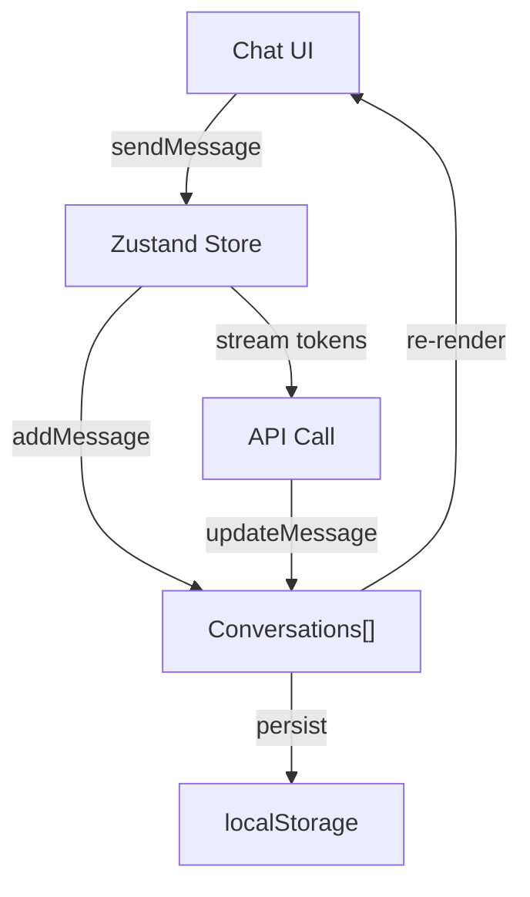

# 📦 State Management cho AI Apps

> **Mục tiêu**: Chat history, Zustand, Optimistic updates, Conversation management.

---

## 0. State Flow Architecture



---

## 1. Chat State Schema

```typescript
interface ChatState {
  conversations: Conversation[];
  activeConversationId: string | null;
  isLoading: boolean;
}

interface Conversation {
  id: string;
  title: string;
  messages: Message[];
  model: string;
  createdAt: Date;
  updatedAt: Date;
}

interface Message {
  id: string;
  role: 'user' | 'assistant' | 'system';
  content: string;
  timestamp: Date;
  metadata?: {
    tokens_used?: number;
    latency_ms?: number;
    sources?: string[];  // RAG sources
  };
}
```

---

## 2. Zustand Store

```typescript
import { create } from 'zustand';
import { persist } from 'zustand/middleware';

const useChatStore = create(
  persist(
    (set, get) => ({
      conversations: [],
      activeId: null,
      
      // Create new conversation
      newConversation: () => {
        const id = crypto.randomUUID();
        set(state => ({
          conversations: [...state.conversations, {
            id, title: 'New Chat', messages: [], model: 'gpt-4o-mini',
            createdAt: new Date(), updatedAt: new Date(),
          }],
          activeId: id,
        }));
      },
      
      // Add message
      addMessage: (conversationId, message) => {
        set(state => ({
          conversations: state.conversations.map(c =>
            c.id === conversationId
              ? { ...c, messages: [...c.messages, message], updatedAt: new Date() }
              : c
          ),
        }));
      },
      
      // Update streaming message
      updateMessage: (conversationId, messageId, content) => {
        set(state => ({
          conversations: state.conversations.map(c =>
            c.id === conversationId
              ? {
                  ...c,
                  messages: c.messages.map(m =>
                    m.id === messageId ? { ...m, content } : m
                  ),
                }
              : c
          ),
        }));
      },
      
      // Delete conversation
      deleteConversation: (id) => {
        set(state => ({
          conversations: state.conversations.filter(c => c.id !== id),
          activeId: state.activeId === id ? null : state.activeId,
        }));
      },
    }),
    { name: 'chat-storage' }  // Persist to localStorage
  )
);
```

---

## 3. Optimistic Updates

```typescript
// Show message immediately, handle errors gracefully
const sendMessage = async (content: string) => {
  const { activeId, addMessage, updateMessage } = useChatStore.getState();
  
  // Optimistic: add user message immediately
  const userMsg = { id: uuid(), role: 'user', content, timestamp: new Date() };
  addMessage(activeId, userMsg);
  
  // Optimistic: add empty assistant message
  const assistantId = uuid();
  addMessage(activeId, { id: assistantId, role: 'assistant', content: '', timestamp: new Date() });
  
  try {
    const stream = await streamChat([...messages, userMsg]);
    let fullContent = '';
    
    for await (const token of stream) {
      fullContent += token;
      updateMessage(activeId, assistantId, fullContent);
    }
  } catch (error) {
    // Rollback: update with error message
    updateMessage(activeId, assistantId, '❌ Error: Failed to generate response. Please try again.');
  }
};
---

## 4. Advanced Patterns

### 4.1 Conversation Branching (Fork)

```typescript
// Allow users to "fork" a conversation from any message
const forkConversation = (conversationId: string, fromMessageIndex: number) => {
  const { conversations, setActiveId } = useChatStore.getState();
  const source = conversations.find(c => c.id === conversationId);
  if (!source) return;
  
  const forked: Conversation = {
    id: uuid(),
    title: `${source.title} (fork)`,
    messages: source.messages.slice(0, fromMessageIndex + 1), // Keep up to selected
    createdAt: new Date(),
  };
  
  set(state => ({
    conversations: [forked, ...state.conversations],
    activeId: forked.id,
  }));
};
```

### 4.2 Context Window Management

```typescript
// Truncate old messages to fit LLM context window
const getContextMessages = (
  messages: Message[], 
  maxTokens: number = 4000
): Message[] => {
  let tokenCount = 0;
  const result: Message[] = [];
  
  // Always keep system message
  const systemMsg = messages.find(m => m.role === 'system');
  if (systemMsg) {
    tokenCount += estimateTokens(systemMsg.content);
    result.push(systemMsg);
  }
  
  // Add recent messages (reverse order) until budget exhausted
  for (let i = messages.length - 1; i >= 0; i--) {
    const msg = messages[i];
    if (msg.role === 'system') continue;
    const tokens = estimateTokens(msg.content);
    if (tokenCount + tokens > maxTokens) break;
    tokenCount += tokens;
    result.unshift(msg);
  }
  
  return result;
};

const estimateTokens = (text: string): number => Math.ceil(text.length / 4);
```

### 4.3 Cross-Tab Sync

```typescript
// Sync state changes across browser tabs
const channel = new BroadcastChannel('chat-sync');

// Listen for changes from other tabs
channel.onmessage = (event) => {
  const { type, payload } = event.data;
  if (type === 'NEW_MESSAGE') {
    useChatStore.getState().addMessage(payload.conversationId, payload.message);
  }
};

// Broadcast when sending a message
const sendWithSync = async (content: string) => {
  const msg = { id: uuid(), role: 'user', content, timestamp: new Date() };
  const activeId = useChatStore.getState().activeId;
  
  useChatStore.getState().addMessage(activeId, msg);
  channel.postMessage({ type: 'NEW_MESSAGE', payload: { conversationId: activeId, message: msg } });
};
```

---

## 5. Undo/Redo Pattern (Regenerate Response)

```typescript
// Extend Zustand store with undo/redo capabilities
const useChatStore = create(
  persist(
    (set, get) => ({
      // ... existing state ...
      undoStack: [] as Message[][],   // Previous message states
      
      // Regenerate last assistant response
      regenerateResponse: async () => {
        const state = get();
        const conv = state.conversations.find(c => c.id === state.activeId);
        if (!conv) return;
        
        // Save current state for undo
        set(state => ({ undoStack: [...state.undoStack, [...conv.messages]] }));
        
        // Remove last assistant message
        const lastUserMsg = [...conv.messages]
          .reverse()
          .find(m => m.role === 'user');
        
        const trimmed = conv.messages.slice(
          0, conv.messages.findLastIndex(m => m.role === 'user') + 1
        );
        
        // Update messages (removes assistant response)
        set(state => ({
          conversations: state.conversations.map(c => 
            c.id === state.activeId ? { ...c, messages: trimmed } : c
          ),
        }));
        
        // Re-send to API with same user message
        if (lastUserMsg) {
          await get().sendMessage(lastUserMsg.content);
        }
      },
      
      // Undo last action
      undo: () => {
        const { undoStack } = get();
        if (undoStack.length === 0) return;
        const previousMessages = undoStack[undoStack.length - 1];
        set(state => ({
          conversations: state.conversations.map(c =>
            c.id === state.activeId ? { ...c, messages: previousMessages } : c
          ),
          undoStack: state.undoStack.slice(0, -1),
        }));
      },
    }),
    { name: 'chat-storage' }
  )
);
```

---

## 6. Offline-First Queue

```typescript
// Queue messages when offline, sync when back online
class OfflineQueue {
  private queue: Array<{ conversationId: string; content: string; timestamp: number }> = [];
  
  constructor() {
    // Listen for online/offline events
    window.addEventListener('online', () => this.flush());
    window.addEventListener('offline', () => {
      console.log('Offline mode: messages will be queued');
    });
    
    // Load persisted queue from IndexedDB
    this.loadFromStorage();
  }
  
  enqueue(conversationId: string, content: string) {
    this.queue.push({ conversationId, content, timestamp: Date.now() });
    this.saveToStorage();
  }
  
  async flush() {
    console.log(`Syncing ${this.queue.length} queued messages...`);
    const pending = [...this.queue];
    this.queue = [];
    
    for (const msg of pending) {
      try {
        await sendMessage(msg.conversationId, msg.content);
      } catch {
        this.queue.push(msg); // Re-queue on failure
      }
    }
    this.saveToStorage();
  }
  
  private saveToStorage() {
    localStorage.setItem('offline-queue', JSON.stringify(this.queue));
  }
  
  private loadFromStorage() {
    const saved = localStorage.getItem('offline-queue');
    if (saved) this.queue = JSON.parse(saved);
  }
}

// Usage in sendMessage:
async function sendMessage(conversationId: string, content: string) {
  if (!navigator.onLine) {
    offlineQueue.enqueue(conversationId, content);
    showToast('Message queued — will send when online');
    return;
  }
  // ... normal API call ...
}
```

---

## 🎯 Interview Tips — Chi Tiết

### Q1: "Chat state management approach?"
**A**: Zustand: lightweight (1KB), no boilerplate, built-in persist. Redux overkill for most AI apps.

### Q2: "Optimistic updates trong chat?"
**A**: Show user message immediately. Create empty assistant placeholder. Stream tokens into it. On error: replace with error.

### Q3: "Chat persistence strategy?"
**A**: L1: localStorage (Zustand persist). L2: IndexedDB (large files). L3: Backend DB (cross-device sync).

### Q4: "Conversation list performance?"
**A**: Only store last 50 in memory, paginate rest. Lazy load message history on open.

### Q5: "Real-time sync multi-tab?"
**A**: `BroadcastChannel` API for cross-tab. Supabase Realtime for cross-device. Last-write-wins.

### Q6: "State shape design tradeoffs?"
**A**: Normalized (entities by ID): fast O(1) lookup. Nested: simpler reasoning. Chat apps: nested is fine.
