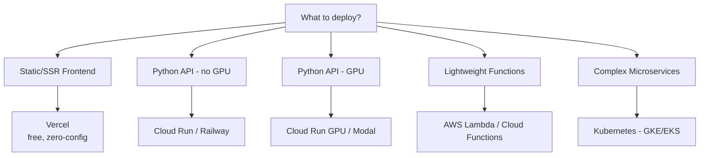

# 🚢 Deployment cho AI Apps — Production Guide

> **Mục tiêu**: Vercel, Cloud Run, Docker, CI/CD, monitoring, scaling, zero-downtime.
> Deployment = "cầu nối" research → users. 90% giá trị tạo ra ở production.

---

## 1. Deployment Options

| Platform | Best for | GPU | Cost | Scaling | Cold Start |
|----------|----------|:---:|------|---------|:----------:|
| **Vercel** | Next.js frontend | ❌ | Free tier | Auto | ~100ms |
| **Cloud Run** | Backend API | ✅ (L4) | Pay per use | Auto | 5-30s |
| **Railway** | Full-stack | ❌ | $5+/mo | Auto | ~2s |
| **Modal** | ML inference | ✅ | Per second | Auto | 10-60s |
| **AWS Lambda** | Light inference | ❌ | Per request | Auto | 5-15s |
| **Fly.io** | Global edge | ❌ | $0.02/hr | Manual | ~2s |
| **K8s (GKE/EKS)** | Complex systems | ✅ | Variable | HPA | Depends |

### Decision Flowchart



---

## 2. Cloud Run Deployment

### 2.1 Basic Deploy

```bash
# Build and deploy
gcloud builds submit --tag gcr.io/PROJECT/ai-api:v1
gcloud run deploy ai-api \
    --image gcr.io/PROJECT/ai-api:v1 \
    --memory 4Gi \
    --cpu 2 \
    --min-instances 1 \        # Avoid cold starts!
    --max-instances 10 \
    --timeout 300 \            # 5 min for AI requests
    --concurrency 80 \         # Max requests per instance
    --set-env-vars OPENAI_API_KEY=sk-xxx \
    --allow-unauthenticated

# With GPU (ML inference)
gcloud run deploy ai-gpu-api \
    --gpu 1 \
    --gpu-type nvidia-l4 \
    --memory 16Gi \
    --cpu 4 \
    --min-instances 1 \        # GPU cold starts = 30-60s!
    --max-instances 5
```

### 2.2 Cloud Run Best Practices

```
✅ DO:
  - Set min-instances=1 for latency-sensitive endpoints
  - Use startup-cpu-boost for faster cold starts
  - Health check endpoint (/healthz)
  - Set memory limit based on actual usage + 20% buffer
  - Use Cloud Build triggers for auto-deploy on push

❌ DON'T:
  - Don't store state in container (stateless!)
  - Don't use SQLite in production (use Cloud SQL)
  - Don't hardcode secrets (use Secret Manager)
  - Don't set timeout too low for AI workloads (300s minimum)
```

---

## 3. Docker Production Setup

### 3.1 Multi-stage Dockerfile

```dockerfile
# ══════════ Stage 1: Build dependencies ══════════
FROM python:3.11-slim AS builder
WORKDIR /app

# Install system deps for compiled packages
RUN apt-get update && apt-get install -y --no-install-recommends \
    build-essential && rm -rf /var/lib/apt/lists/*

COPY requirements.txt .
RUN pip install --no-cache-dir --prefix=/install -r requirements.txt

# ══════════ Stage 2: Production runtime ══════════
FROM python:3.11-slim
COPY --from=builder /install /usr/local
WORKDIR /app

# Copy only needed files
COPY src/ src/
COPY models/ models/        # Pre-downloaded models

# Non-root user (security!)
RUN adduser --disabled-password --gecos '' appuser \
    && chown -R appuser:appuser /app
USER appuser

# Health check
HEALTHCHECK --interval=30s --timeout=10s --retries=3 \
    CMD python -c "import urllib.request; urllib.request.urlopen('http://localhost:8000/healthz')"

EXPOSE 8000
CMD ["uvicorn", "src.app:app", "--host", "0.0.0.0", "--port", "8000", "--workers", "4"]
```

### 3.2 Docker Compose for Development

```yaml
# docker-compose.yml
version: "3.8"

services:
  api:
    build: ./backend
    ports:
      - "8000:8000"
    environment:
      - OPENAI_API_KEY=${OPENAI_API_KEY}
      - DATABASE_URL=postgresql://user:pass@db:5432/aiapp
      - REDIS_URL=redis://redis:6379
    depends_on:
      db:
        condition: service_healthy
      redis:
        condition: service_started
    volumes:
      - ./backend/src:/app/src  # Hot reload in dev
    restart: unless-stopped

  db:
    image: pgvector/pgvector:pg16
    environment:
      POSTGRES_DB: aiapp
      POSTGRES_USER: user
      POSTGRES_PASSWORD: pass
    volumes:
      - pgdata:/var/lib/postgresql/data
    healthcheck:
      test: ["CMD-SHELL", "pg_isready -U user -d aiapp"]
      interval: 5s
      timeout: 3s
      retries: 5

  redis:
    image: redis:7-alpine
    ports:
      - "6379:6379"

  frontend:
    build: ./frontend
    ports:
      - "3000:3000"
    environment:
      - NEXT_PUBLIC_API_URL=http://api:8000

volumes:
  pgdata:
```

### 3.3 .dockerignore

```
# .dockerignore — CRITICAL for build speed
.git
.venv
__pycache__
*.pyc
.env
node_modules
*.log
.mypy_cache
.pytest_cache
data/raw/         # Don't include training data
notebooks/
```

---

## 4. CI/CD Pipeline

### 4.1 GitHub Actions — Full Pipeline

```yaml
# .github/workflows/deploy.yml
name: Deploy AI App

on:
  push:
    branches: [main]
  pull_request:
    branches: [main]

env:
  REGISTRY: gcr.io
  PROJECT_ID: ${{ secrets.GCP_PROJECT_ID }}

jobs:
  # ══════════ 1. Lint & Test ══════════
  test:
    runs-on: ubuntu-latest
    steps:
      - uses: actions/checkout@v4
      - uses: actions/setup-python@v5
        with:
          python-version: "3.11"
          cache: "pip"
      
      - run: pip install -r requirements.txt -r requirements-dev.txt
      - run: ruff check src/          # Lint
      - run: mypy src/                 # Type check
      - run: pytest tests/ -v --cov=src --cov-report=xml
      
      - name: Upload coverage
        uses: codecov/codecov-action@v4
        with:
          file: coverage.xml

  # ══════════ 2. Build & Push Image ══════════
  build:
    needs: test
    if: github.ref == 'refs/heads/main'
    runs-on: ubuntu-latest
    steps:
      - uses: actions/checkout@v4
      
      - name: Auth to GCP
        uses: google-github-actions/auth@v2
        with:
          credentials_json: ${{ secrets.GCP_SA_KEY }}
      
      - name: Build & Push
        run: |
          gcloud builds submit \
            --tag ${{ env.REGISTRY }}/${{ env.PROJECT_ID }}/ai-api:${{ github.sha }}

  # ══════════ 3. Deploy ══════════
  deploy:
    needs: build
    runs-on: ubuntu-latest
    environment: production
    steps:
      - name: Deploy to Cloud Run
        uses: google-github-actions/deploy-cloudrun@v2
        with:
          service: ai-api
          image: ${{ env.REGISTRY }}/${{ env.PROJECT_ID }}/ai-api:${{ github.sha }}
          region: us-central1
      
      - name: Smoke test
        run: |
          URL=$(gcloud run services describe ai-api --region=us-central1 --format='value(status.url)')
          curl -f "$URL/healthz" || exit 1
```

### 4.2 Deployment Strategies

```
Blue-Green:   Deploy new version alongside old → switch traffic instantly
              ✅ Instant rollback  ❌ 2x resources

Canary:       Route 10% traffic to new version → monitor → gradually increase
              ✅ Safe  ❌ Slower rollout

Rolling:      Replace instances one by one
              ✅ Zero downtime  ❌ Mixed versions during rollout

Cloud Run:    Automatic rolling + traffic splitting (canary)
              gcloud run services update-traffic ai-api \
                --to-revisions=new=10,old=90
```

---

## 5. Environment Management

```python
# config.py — Type-safe, validated configuration
from pydantic_settings import BaseSettings
from pydantic import Field

class Settings(BaseSettings):
    # ── Application ──
    app_name: str = "AI App"
    environment: str = Field(default="development", pattern="^(development|staging|production)$")
    debug: bool = False
    log_level: str = "INFO"
    
    # ── LLM ──
    openai_api_key: str = ""
    default_model: str = "gpt-4o-mini"
    max_tokens: int = 4096
    temperature: float = 0.7
    
    # ── Database ──
    database_url: str = "sqlite:///app.db"
    redis_url: str = "redis://localhost:6379"
    
    # ── Security ──
    jwt_secret: str = Field(default="change-me-in-production", min_length=32)
    cors_origins: list[str] = ["http://localhost:3000"]
    rate_limit_per_minute: int = 60
    
    # ── Observability ──
    sentry_dsn: str = ""
    enable_tracing: bool = False
    
    model_config = {"env_file": ".env", "env_file_encoding": "utf-8"}

settings = Settings()

# ── Usage ──
# Development: .env file (gitignored!)
# Production: environment variables or Secret Manager
# Testing: override in conftest.py
```

---

## 6. Monitoring & Observability

### 6.1 Application Monitoring

```python
from fastapi import FastAPI, Request
import time
import structlog

logger = structlog.get_logger()

app = FastAPI()

# ── Request logging middleware ──
@app.middleware("http")
async def log_requests(request: Request, call_next):
    start = time.perf_counter()
    response = await call_next(request)
    duration_ms = (time.perf_counter() - start) * 1000
    
    logger.info("request",
        method=request.method,
        path=request.url.path,
        status=response.status_code,
        duration_ms=round(duration_ms, 1),
        user_agent=request.headers.get("user-agent", ""),
    )
    
    # Track slow requests
    if duration_ms > 5000:
        logger.warning("slow_request", path=request.url.path, duration_ms=duration_ms)
    
    return response

# ── Health endpoints ──
@app.get("/healthz")
async def health():
    return {"status": "healthy"}

@app.get("/readyz")
async def ready():
    """Check all dependencies ready."""
    checks = {
        "database": await check_db(),
        "redis": await check_redis(),
        "model": model is not None,
    }
    all_ready = all(checks.values())
    return {"ready": all_ready, "checks": checks}
```

### 6.2 LLM-specific Monitoring

```python
# Track LLM usage
import tiktoken

class LLMTracker:
    def __init__(self):
        self.encoder = tiktoken.encoding_for_model("gpt-4o")
    
    async def tracked_completion(self, messages, **kwargs):
        input_tokens = sum(len(self.encoder.encode(m["content"])) for m in messages)
        
        start = time.perf_counter()
        response = await openai.chat.completions.create(messages=messages, **kwargs)
        latency = time.perf_counter() - start
        
        output_tokens = response.usage.completion_tokens
        cost = (input_tokens * 2.5 + output_tokens * 10) / 1_000_000  # GPT-4o pricing
        
        logger.info("llm_call",
            model=kwargs.get("model", "gpt-4o"),
            input_tokens=input_tokens,
            output_tokens=output_tokens,
            latency_s=round(latency, 2),
            cost_usd=round(cost, 6),
        )
        
        return response
```

### 6.3 Key Metrics Dashboard

```
Production AI App Metrics:

1. Latency:     P50, P95, P99 response time
2. Throughput:  Requests per second
3. Error Rate:  4xx + 5xx / total requests
4. LLM Usage:   Tokens/day, cost/day, calls/day
5. Cache Hit:   Redis cache hit rate (target >80%)
6. Uptime:      99.9% SLA (8.7 hours downtime/year)
7. Model Perf:  User satisfaction, thumbs up/down ratio
```

---

## 🎯 Interview Tips — Chi Tiết

### Q1: "Full-stack AI deployment architecture?"
**A**: Frontend (Vercel/Cloudflare Pages) → API Gateway → Backend (Cloud Run/K8s) → DB (Supabase/Cloud SQL) + Vector DB (Pinecone/pgvector) + Cache (Redis). LLM calls via API (OpenAI) or self-hosted (vLLM on GPU).

### Q2: "Cold starts mitigate?"
**A**: (1) min-instances=1 (keep warm). (2) startup-cpu-boost (Cloud Run). (3) Lazy model loading (load on first request, not startup). (4) Smaller Docker image (slim base). (5) Pre-warm with health check.

### Q3: "Secret management?"
**A**: Never in code/git. Dev: `.env` file (gitignored). Staging/Prod: Secret Manager (GCP/AWS), injected as env vars. Rotate regularly. Principle of least privilege.

### Q4: "Scaling AI apps?"
**A**: (1) Horizontal: more instances (Cloud Run auto-scales). (2) Cache: Redis for repeated queries (80%+ cache hit common). (3) Queue: async for heavy tasks (Celery/Cloud Tasks). (4) CDN: cache static responses. (5) Batching: batch LLM calls.

### Q5: "Zero-downtime deployment?"
**A**: Rolling updates (replace instances gradually). Canary (10% → 50% → 100%). Cloud Run: automatic — new revision, traffic split. Health check must pass before receiving traffic.

### Q6: "CI/CD for ML apps?"
**A**: Push → lint + test → build Docker → deploy to staging → smoke test → canary deploy to prod → monitoring → full rollout. Quality gates: test coverage >80%, latency P95 <2s, no regressions.

### Q7: "LLM cost control?"
**A**: (1) Cache identical queries (Redis). (2) Use cheaper models (4o-mini for simple tasks). (3) Prompt optimization (shorter prompts). (4) Rate limiting per user. (5) Token budgets per request. (6) Monitor daily cost alerts.

### Q8: "Docker best practices?"
**A**: Multi-stage builds (smaller image). Non-root user (security). Health checks. .dockerignore (fast builds). Pin versions (reproducible). Slim base images (python:3.11-slim not python:3.11).
