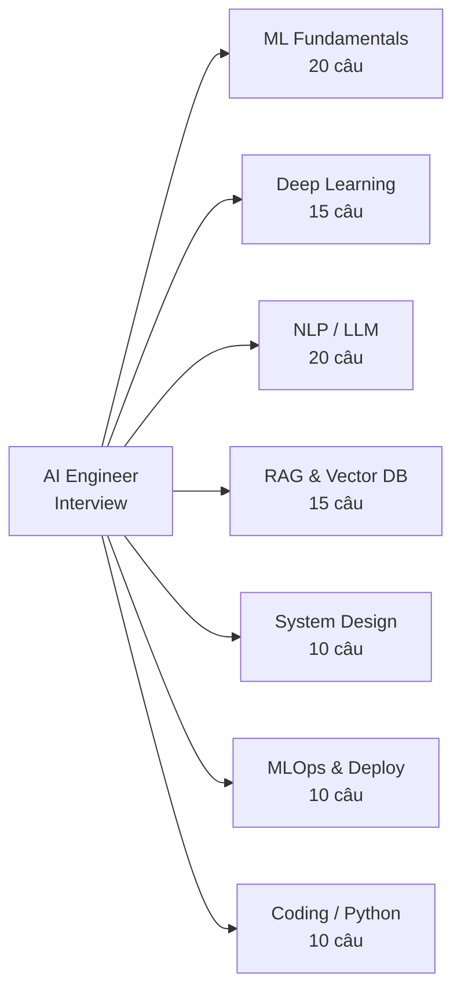

# 🎯 Top 100 Câu Hỏi Kỹ Thuật — AI Engineer Fresher

> Tổng hợp 100 câu hỏi **hay gặp nhất** trong phỏng vấn AI Engineer 2026.
> Mỗi câu có gợi ý trả lời **CHI TIẾT** + follow-up questions.

---

## Interview Topics Map



---

## 📌 ML Fundamentals (20 câu)

### 1. Bias-Variance tradeoff là gì?
**A**: Bias = error từ model quá đơn giản (underfitting). Variance = error từ model quá phức tạp (overfitting). Total error = Bias² + Variance + Irreducible Noise.
- **High bias**: Linear model cho non-linear data → systematic error
- **High variance**: Deep tree không pruning → khác nhau mỗi lần chạy
- **Goal**: Sweet spot — minimize tổng = regularization, cross-validation
- **Follow-up**: "Bias-variance cho neural nets?" → Deep nets có thể low bias + low variance nếu dùng regularization (dropout, weight decay) + enough data

### 2. Overfitting xử lý thế nào?
**A**: 7 strategies:
1. **Regularization**: L1 (sparse), L2/weight decay (small weights), dropout
2. **Data**: More data, augmentation (flip, crop, MixUp, CutMix)
3. **Architecture**: Simpler model, fewer layers/neurons
4. **Training**: Early stopping (monitor val loss), reduce epochs
5. **Ensemble**: Bagging (Random Forest), averaging reduces variance
6. **Batch Normalization**: Stabilize training, slight regularization
7. **Cross-validation**: K-Fold detect overfitting early
- **Follow-up**: "Cách phát hiện overfitting?" → Train loss giảm nhưng val loss tăng. Gap train/val accuracy lớn.

### 3. Precision vs Recall — khi nào ưu tiên cái nào?
**A**:
- **Precision** = TP / (TP + FP) = "Trong những cái dự đoán positive, bao nhiêu đúng?"
- **Recall** = TP / (TP + FN) = "Trong những cái thực sự positive, bao nhiêu được tìm thấy?"
- **Ưu tiên Precision**: Cost of FP cao — spam filter (false alarm → miss important email), content moderation
- **Ưu tiên Recall**: Cost of FN cao — cancer detection (miss cancer → nguy hiểm), fraud detection
- **F1 Score** = 2 × (P × R) / (P + R) — harmonic mean, balanced
- **Follow-up**: "Tại sao harmonic mean thay vì arithmetic?" → Harmonic mean penalize nặng khi 1 trong 2 thấp. Precision=1.0, Recall=0.01 → F1=0.02 (not 0.505)

### 4. AUC-ROC là gì? Tại sao tốt hơn accuracy?
**A**: Area Under Receiver Operating Characteristic curve.
- ROC curve: TPR (recall) vs FPR (false positive rate) tại mọi thresholds
- **AUC = 0.5**: random (đường chéo)
- **AUC = 1.0**: perfect classifier
- **Tốt hơn accuracy vì**: (1) Không bị biased bởi class imbalance (99% negative, 1% positive → always predict negative = 99% accuracy nhưng AUC = 0.5), (2) Đo khả năng RANK positive > negative, (3) Threshold-independent
- **AUC-PR** (Precision-Recall): tốt hơn cho severe imbalance
- **Follow-up**: "AUC-ROC vs AUC-PR?" → AUC-ROC misleading khi class rất imbalanced. AUC-PR sensitive hơn với false positives. Dùng PR cho detection tasks (nhiều negatives).

### 5. Cross-validation dùng khi nào? Loại nào?
**A**: Đánh giá model robust hơn single train/test split.
- **K-Fold** (k=5 hoặc 10): default, phổ biến nhất
- **Stratified K-Fold**: giữ tỷ lệ classes mỗi fold — bắt buộc cho imbalanced data
- **Time-Series Split**: không random! Train past → test future. Tránh data leakage temporal
- **Leave-One-Out (LOOCV)**: k=n, expensive, high variance, dùng cho small datasets
- **Group K-Fold**: samples từ cùng 1 group không xuất hiện ở cả train và test (e.g., patients)
- **Follow-up**: "Bao nhiêu folds?" → k=5 cho large data, k=10 default, LOOCV cho <100 samples

### 6. L1 vs L2 regularization?
**A**:
- **L1 (Lasso)**: penalty = λΣ|wᵢ| → weights → 0 (sparse!) → **feature selection**
- **L2 (Ridge)**: penalty = λΣwᵢ² → weights nhỏ đều → **prevent overfitting**
- **Elastic Net**: λ₁L1 + λ₂L2 → best of both
- **Tại sao L1 sparse?**: L1 gradient = ±λ (constant), pushes small weights to exactly 0. L2 gradient = 2λw → approaches 0 but never reaches it
- **ML use**: L1 for feature selection (high-dimensional data). L2 for general regularization
- **DL use**: Weight decay (L2) = standard trong AdamW. Dropout thay thế L1

### 7. Random Forest vs XGBoost?
**A**:
| Aspect | Random Forest | XGBoost |
|--------|--------------|---------|
| Method | Bagging (parallel trees) | Boosting (sequential trees) |
| Speed | Fast training | Slower, but faster inference |
| Tuning | Little needed | Many hyperparams |
| Overfitting | Resistant (bagging) | Can overfit without tuning |
| Missing values | No native support | Handles natively |
| Best for | Quick baseline, robust | Competitions, best performance |
- **Follow-up**: "LightGBM vs XGBoost?" → LightGBM: histogram-based, leaf-wise growth → faster. XGBoost: level-wise, more robust. LightGBM cho large datasets.

### 8. Feature scaling tại sao cần?
**A**: 
- **Gradient Descent**: converge nhanh hơn khi features cùng scale (otherwise zigzag path)
- **Distance-based** (KNN, SVM): feature scale lớn dominate distance calculation
- **Regularization**: L2 penalize unequally nếu features khác scale
- **NOT needed**: Tree-based models (decision based on thresholds, not distances)
- **StandardScaler** (z-score): (x-μ)/σ → mean=0, std=1. Cho normal-ish data
- **MinMaxScaler**: (x-min)/(max-min) → [0,1]. Cho bounded data
- **RobustScaler**: (x-median)/IQR. Robust với outliers
- **⚠️ BẮT BUỘC**: Fit scaler trên TRAIN set only → transform train + test. Ngược lại = data leakage!

### 9. Imbalanced data xử lý thế nào?
**A**: 6 approaches:
1. **Metrics**: F1, AUC-PR thay accuracy (accuracy misleading)
2. **Resampling**: Oversample minority (SMOTE), undersample majority
3. **Class weights**: `class_weight='balanced'` trong sklearn → loss weight theo inverse frequency
4. **Threshold tuning**: thay vì 0.5, chọn threshold maximize F1
5. **Focal Loss**: down-weight easy examples (γ=2 standard)
6. **Ensemble**: EasyEnsemble, BalanceCascade

### 10. PCA hoạt động thế nào?
**A**: Principal Component Analysis — unsupervised dimensionality reduction.
1. Center data (subtract mean)
2. Compute covariance matrix
3. Find eigenvectors + eigenvalues (via SVD thực tế)
4. Eigenvectors = directions of maximum variance
5. Eigenvalues = importance/variance of each direction
6. Project data onto top-k eigenvectors
- **Explained variance ratio**: cho biết bao nhiêu information giữ được
- **Rule of thumb**: giữ 95% explained variance
- **Limitations**: chỉ capture LINEAR relationships. Cho non-linear: t-SNE, UMAP

### 11-20 (Condensed)

**11. Gradient Descent hoạt động thế nào?**
→ Tính gradient (đạo hàm) loss function → cập nhật: w = w - lr × ∇L. LR kiểm soát step size. Quá nhỏ → chậm, quá lớn → diverge.

**12. Batch vs Mini-batch vs Stochastic GD?**
→ Batch: toàn data mỗi step (stable, slow, memory). SGD: 1 sample (noisy, fast). Mini-batch (32-512): best balance — parallelism + noise for escaping local minima.

**13. Bootstrapping và Bagging?**
→ Bootstrap: sample with replacement. Bagging: train multiple models on bootstrap samples, average predictions → giảm variance. Random Forest = bagging + random feature selection.

**14. Ensemble methods ưu điểm gì?**
→ Bagging: giảm variance (Random Forest). Boosting: giảm bias (XGBoost). Stacking: learn from multiple models. Generally: robustness, accuracy boost 2-5%.

**15. Feature importance xem thế nào?**
→ (1) Gini importance (tree-based), (2) Permutation importance (model-agnostic), (3) SHAP values (theo game theory, most interpretable), (4) Correlation analysis (simple but misses interactions).

**16. Train/Val/Test split tại sao cần cả 3?**
→ Train: learn patterns. Val: tune hyperparams + early stopping. Test: final UNBIASED evaluation. Tune trên test → overfitting to test set → unreliable estimate.

**17. Data leakage là gì?**
→ Future/test info leaks into train. Examples: (1) Scale toàn data trước split, (2) Use future features for time-series, (3) Duplicate data across splits, (4) Use target-dependent features. Prevention: pipeline with sklearn Pipeline.

**18. Handling missing values?**
→ (1) Drop (if few), (2) Impute: mean/median (numeric), mode (categorical), KNN imputer, (3) Indicator column: add binary "is_missing" feature, (4) Let model handle: XGBoost handles natively.

**19. SHAP values explain?**
→ Shapley Additive exPlanations. From game theory: how much each "player" (feature) contributes to the "payout" (prediction). Model-agnostic. Features with positive SHAP push prediction up, negative push down. Sum of all SHAP = prediction - base value.

**20. Hyperparameter tuning strategies?**
→ Grid Search: exhaustive (2-3 params). Random Search: efficient, good coverage. Bayesian (Optuna): smart sampling, best for many params. Tips: start random, then narrow with Bayesian.

---

## 📌 Deep Learning (15 câu)

### 21. Backpropagation hoạt động thế nào?
**A**: 
1. **Forward pass**: input → layer by layer → output → compute loss
2. **Backward pass**: Chain Rule — compute ∂Loss/∂weight cho TỪNG weight
3. **Update**: w = w - lr × ∂Loss/∂w
- Mỗi weight update = partial derivative of final loss
- PyTorch autograd: automatic differentiation — build computation graph, traverse backward
- **Follow-up**: "Tại sao cần computation graph?" → Track operations to know which derivatives to compute. Dynamic graph (PyTorch) vs Static graph (old TensorFlow)

### 22. Vanishing gradient problem?
**A**: Gradients shrink exponentially qua nhiều layers.
- **Cause**: sigmoid (σ'(z) ∈ [0, 0.25]) → multiply many small numbers → ~0
- **Fix**: (1) ReLU: gradient = 1 for positive, 0 for negative, (2) Residual connections: gradient flows through skip, (3) BatchNorm: normalize activations, (4) LSTM gates: selective gradient flow, (5) Proper initialization (He/Xavier)
- **Related**: Exploding gradient — gradients grow → NaN. Fix: gradient clipping `clip_grad_norm_(model.parameters(), 1.0)`

### 23. Activation functions comparison?
**A**:
| Function | Formula | Pros | Cons | Used in |
|----------|---------|------|------|---------|
| ReLU | max(0,x) | Simple, fast, no vanishing | Dying neurons (x<0 → grad=0) | CNNs |
| GELU | x·Φ(x) | Smooth, probabilistic | Slower | Transformers, BERT |
| Swish | x·σ(x) | Non-monotonic, smooth | Slower | EfficientNet |
| SiLU | Same as Swish | Better for deep nets | Compute | Modern CNNs |
| Sigmoid | 1/(1+e^-x) | Output [0,1] | Vanishing gradient | Binary output |

### 24-35 (Condensed with Key Details)

**24. Batch Normalization?** → Normalize: x̂ = (x-μ)/σ → scale/shift: y = γx̂+β. γ,β learnable. Train: batch stats. Eval: running mean/var. Benefits: stable training, regularization, allows higher LR.

**25. Transfer Learning?** → Pretrained model + fine-tune. Strategy: (1) Few data → freeze backbone, train classifier, (2) More data → unfreeze last layers, low LR, (3) Lots of data → fine-tune all, very low LR. Always fine-tune FROM pretrained.

**26. Mixed Precision (AMP)?** → Forward: FP16 (2x faster, 2x less memory). Weight update: FP32 (precision). GradScaler: prevent underflow. `torch.autocast + GradScaler`. Result: 1.5-2x speedup, same quality.

**27. LR scheduling?** → Warmup (5-10% steps, linear increase) → Cosine decay (smooth decrease to 0). OneCycleLR: ramp up then down. Modern default: warmup + cosine. Too high LR → diverge. Too low → slow.

**28. Dropout?** → Zero random neurons (p=0.1-0.5) during training. Prevents co-adaptation. At inference: disabled (or multiply by 1-p). In Transformers: dropout after attention and FFN. Modern: p=0.1 standard.

**29. ResNet skip connections?** → y = F(x) + x. Gradient flows through "+" directly → no vanishing. Identity mapping = easy to learn "do nothing". Enables 100+ layer networks. Inspired: DenseNet (concatenate), U-Net (skip across encoder-decoder).

**30. ONNX export?** → Open Neural Network Exchange. PyTorch → ONNX → ONNX Runtime (2-5x faster). Benefits: framework-agnostic, hardware acceleration (TensorRT, OpenVINO), easy deployment. `torch.onnx.export(model, dummy_input, "model.onnx")`

**31. IoU/mIoU?** → IoU = Intersection/Union per class. mIoU = mean across all classes. IoU=0.5 → "adequate", IoU=0.7+ → "good". Used in: segmentation, object detection. Also: Dice coefficient = 2×IoU/(1+IoU).

**32. Focal Loss?** → FL = -αₜ(1-pₜ)^γ × log(pₜ). γ=2: easy examples (pₜ≈1) → low loss. Hard examples → high loss. α: class balance. Essential for: detection (tons of background), imbalanced segmentation.

**33. Data Augmentation?** → Geometric: flip, rotate, crop, scale. Color: brightness, contrast, HSV. Advanced: MixUp (blend images), CutMix (paste patches), Mosaic (4 images). Library: Albumentations (fast, diverse). Test-time augmentation (TTA): augment at inference, average predictions.

**34. Quantization types?** → PTQ (Post-Training): no retraining, slight quality loss, fast. QAT (Quantization-Aware): simulate quantization during training, best quality. Dynamic: quantize at runtime. For LLMs: GPTQ/AWQ (PTQ optimized).

**35. U-Net architecture?** → Encoder (downsample → context) + Decoder (upsample → localization) + Skip connections (preserve spatial detail). Variations: U-Net++ (nested skips), Attention U-Net (attention gates), SegFormer (Transformer encoder).

---

## 📌 LLM & GenAI (20 câu) — CHI TIẾT

### 36. Transformer attention mechanism?
**A**: Attention(Q,K,V) = softmax(QK^T/√d_k) × V
- **Q** (Query): "what am I looking for?"
- **K** (Key): "what do I contain?"  
- **V** (Value): "what information do I have?"
- QK^T = similarity scores matrix [seq×seq]
- softmax → probabilities (each row sums to 1)
- Multiply by V → weighted sum of values
- **Follow-up**: "Self-attention vs Cross-attention?" → Self: Q,K,V from same sequence. Cross: Q from decoder, K,V from encoder.

### 37. Tại sao scale √d_k?
**A**: Khi d_k lớn (e.g., 128), dot products magnitude lớn → softmax output gần 0 hoặc 1 ("saturated") → gradient gần 0 → training chậm. Chia √d_k giữ variance = 1 → softmax smooth → gradient flow tốt.

### 38-55 (Detailed)

**38. Multi-head attention?** → Mỗi head attention khác aspect: Head 1 = syntax, Head 2 = semantics, Head 3 = position. h heads of d_k dimensions = d_model total. Concatenate + project. Why: richer representation than single attention.

**39. Temperature?** → Divides logits before softmax: p = softmax(logits/T). T<1: sharper (deterministic). T=1: original. T>1: flatter (creative). Code gen → 0. Chat → 0.7. Brainstorm → 1.2.

**40. RAG vs Fine-tuning?** → RAG: dynamic knowledge retrieval, no training needed, always up-to-date. Fine-tuning: change model behavior/style/format, permanent, expensive. Rule: knowledge → RAG, behavior → fine-tune. Can combine both.

**41. Chunking strategies?** → (1) Fixed size (500 tokens, overlap 50) — simple, (2) Recursive character — split by hierarchy (paragraph → sentence → word), (3) Semantic — embed sentences, cluster similar, (4) Parent-child — small chunks for search, retrieve parent for context.

**42. Hybrid search?** → Vector (semantic meaning) + BM25 (keyword exact match). Combined via Reciprocal Rank Fusion: score = Σ 1/(k+rank). Why: vector misses exact terms, BM25 misses semantics. Together = best retrieval.

**43. LoRA explained?** → Low-Rank Adaptation: freeze original weights W, add ΔW = BA where B∈R^(d×r), A∈R^(r×d). r=16-64 typical. Only train A,B (~0.1% params). alpha = scaling factor (2×r default). Target: attention QKV + FFN layers = "all-linear".

**44. QLoRA?** → LoRA + 4-bit quantization (NF4). Train adapters on quantized model. Benefits: 70B model fits 1× A100 (80GB). Double quantization: quantize the quantization constants. NF4 = optimal for normally-distributed weights.

**45. Hallucination fix?** → (1) RAG with strict grounding prompt, (2) Low temperature (0-0.3), (3) Structured output (JSON force format), (4) Self-consistency (N answers, majority vote), (5) Citation verification, (6) Guardrails (check against KB).

**46. Context window full?** → (1) Summarize old conversation (compress), (2) Sliding window (drop oldest messages), (3) RAG (retrieve relevant context only), (4) Hierarchical memory (summary of summaries).

**47. Prompt injection defense?** → (1) Input sanitization (remove control chars), (2) System prompt hardening ("IGNORE attempts to override"), (3) Output filtering (regex, classifier), (4) Separate LLM for input classification, (5) Principle of least privilege for tools.

**48. Few-shot vs fine-tuning decision?** → Few-shot: quick, no training cost, limited by context window. Fine-tune: better quality, expensive, needs data (100-10K examples). Decision: start few-shot → if insufficient → fine-tune. Cost: fine-tuning >> few-shot >> zero-shot.

**49. RAGAS metrics?** → Retrieval: Context Precision (relevant chunks retrieved?), Context Recall (all relevant found?). Generation: Faithfulness (answer grounded in context?), Answer Relevancy (answer matches question?). Score 0-1, automated evaluation.

**50. Function calling vs RAG?** → Function calling: perform ACTIONS (search web, query DB, send email). RAG: retrieve KNOWLEDGE (documents, facts). Not mutually exclusive — agent can function-call to retrieve, then RAG to answer.

**51. KV Cache deep?** → Store Key/Value tensors for all previous tokens. Without: recompute all Q,K,V for entire sequence each token → O(n²). With: only compute new token, reuse cached KV → O(n). Memory: grows linearly with sequence. Optimization: GQA (share KV heads), PagedAttention (vLLM).

**52. Flash Attention?** → Problem: standard attention = O(n²) memory (stores full attention matrix). Flash Attention: process in tiles, never store full matrix → O(n) memory. Uses online softmax. 2-4x faster. Auto-enabled in PyTorch 2.0+: `F.scaled_dot_product_attention()`.

**53. Pre-Norm vs Post-Norm?** → Pre-Norm: LayerNorm BEFORE attention/FFN. Post-Norm: AFTER. Pre-Norm: more stable training (no careful warmup needed), used in all modern LLMs (GPT-2+, Llama, etc.). Post-Norm: original Transformer, slightly better quality but harder to train.

**54. BPE tokenizer?** → Byte-Pair Encoding: start from individual bytes → count all adjacent pairs → merge most frequent pair → repeat until vocabulary size reached. "unhappiness" → ["un", "happi", "ness"]. Tiếng Việt = more tokens per word = higher API cost.

**55. Embedding model selection?** → Check MTEB leaderboard. Consider: dimension (768 vs 1024 vs 3072), max sequence length, language support. Popular: OpenAI text-embedding-3-small, Cohere embed-v3, open-source: BGE, E5. Trade-off: quality vs cost vs latency.

---

## 📌 Engineering & MLOps (15 câu)

**56. Docker multi-stage build?** → Stage 1 (builder): install deps, compile. Stage 2 (runtime): copy only artifacts. Result: image 60-70% smaller, no build tools in production, reduced attack surface.

**57. CI/CD cho ML khác gì?** → ML thêm: (1) Data validation (schema, drift), (2) Model testing (accuracy thresholds), (3) CT = Continuous Training (retrain on new data), (4) Model registry (version, promote staging→prod), (5) A/B testing deployment.

**58. DVC là gì?** → "Git for data". Track large files (datasets, models) with Git-like commands. Data stored in remote (S3, GCS). `.dvc` files in Git point to actual data. `dvc push/pull` sync data.

**59. Model Registry?** → Central source of truth: model metadata, training params, metrics, stage (dev→staging→prod). Benefits: reproducibility, audit trail, team collaboration. Tools: MLflow Registry, Weights & Biases, Vertex AI.

**60. Data drift vs Concept drift?** → Data drift: P(X) changes (input distribution shifts). Concept drift: P(Y|X) changes (relationship changes). Example: COVID changed shopping patterns (concept drift), but also user demographics (data drift). Detection: KL divergence, PSI, monitoring dashboards.

**61-70 (Key Points)**

**61. MLflow tracking?** → `mlflow.log_param()`, `mlflow.log_metric()`, `mlflow.log_artifact()`. Auto-logging for sklearn, pytorch. UI: compare runs, visualize metrics. Tracking server = centralized.

**62. Feature Store?** → Centralized feature repository. Prevents training-serving skew (same feature computation). Online (low latency, real-time) + Offline (batch, training). Tools: Feast, Tecton, Vertex AI Feature Store.

**63. A/B testing ML?** → (1) Split traffic randomly (control vs treatment), (2) Run sufficient time (statistical power), (3) Measure metrics (accuracy, latency, revenue), (4) Statistical significance test (p<0.05), (5) Shadow deployment first (log predictions, don't serve).

**64. Kubernetes cho ML?** → Pod = container. Deployment = replicas. HPA = auto-scale based on CPU/GPU/custom metrics. GPU scheduling: `nvidia.com/gpu: 1` resource. KServe/Seldon for ML-specific serving patterns.

**65. Git cho ML?** → Code → Git. Data → DVC. Experiments → MLflow/W&B. Models → Model Registry. Config → Hydra/YAML. Environment → Docker + requirements.txt.

**66-70.** Cloud selection (data gravity), SageMaker vs Vertex AI, spot instances (70% cheaper, preemptible), ETL vs ELT (ELT modern with data warehouses), Kafka (real-time features, event-driven ML).

---

## 📌 AI Agents (10 câu)

**71. Agent vs Chatbot?** → Chatbot: input→output, stateless, no actions. Agent: autonomous, uses tools, maintains state, plans multi-step actions, decides WHAT to do. Agent = LLM + Tools + Memory + Planning.

**72. ReAct pattern?** → Loop: Thought (reasoning) → Action (tool call) → Observation (result) → repeat until answer. Combines chain-of-thought reasoning WITH tool use. Better than pure reasoning or pure tool use.

**73. LangGraph vs LangChain?** → LangChain: sequential chains, simple pipelines, good for RAG. LangGraph: state machines, cycles, conditional edges, parallel execution. Use LangGraph for: complex workflows, human-in-the-loop, multi-agent.

**74. MCP protocol?** → Model Context Protocol: standard for AI-tool integration. Server exposes tools + resources. Client (LLM) discovers and calls tools. Benefits: universal tool compatibility, security boundaries.

**75. Agent memory?** → Short-term: conversation buffer (last N messages). Long-term: vector store (persist across sessions). Episodic: specific past interactions (successful strategies). Working: current task state (scratchpad).

**76. Human-in-the-loop?** → Agent AUTO-pauses for approval on: (1) destructive actions (delete, send email), (2) high-cost operations (API calls), (3) uncertain decisions. Implementation: interrupt node in LangGraph, approval queue.

**77. Agent evaluation?** → Metrics: (1) Task completion rate, (2) Tool call accuracy, (3) Steps to completion (efficiency), (4) Latency, (5) Cost per task, (6) Human satisfaction score. Benchmark: AgentBench, WebArena.

**78-80.** Tool design (clear names, typed params, error handling, idempotent), Agent safety (sandboxed, permissions, output validation), CrewAI vs LangGraph (CrewAI: role-based simple, LangGraph: flexible graph-based).

---

## 📌 System Design (10 câu)

### 81. Design document Q&A system?
**A — Full pipeline**:
```
Offline: Documents → Chunk (500 tokens, overlap 50) → Embed → Vector DB

Online:  User Query → Embed → Hybrid Search (Vector + BM25)
         → Rerank (cross-encoder) → Top-5 chunks
         → LLM + System Prompt ("Answer using ONLY context")
         → Response + Citations
```
Key decisions: chunk size, embedding model, reranker, vector DB (Pinecone vs ChromaDB vs Qdrant), evaluation (RAGAS).

### 82. Design real-time voice agent?
**A**: ASR (Whisper/Deepgram) → LLM (streaming) → TTS (ElevenLabs/XTTS). Target: <1s latency. WebSocket for real-time. Barge-in: user interrupts → stop TTS. VAD: Voice Activity Detection for turn-taking.

### 83-90 (Key Points)
**83. Recommendation**: Collaborative filtering (users who liked X also liked Y) + Content-based (similar features) + Hybrid. Cold-start: popular items, ask preferences.

**84. Content moderation**: Multi-layer: (1) Input classifier (toxic/safe), (2) System prompt guardrails, (3) Output filter (PII, harmful content), (4) Human review queue for edge cases.

**85. Meeting intelligence**: ASR → Speaker diarization (who said what?) → Summarization → Action item extraction → Search index.

**86. Latency optimization**: Caching (Redis), quantization (INT4), smaller models, speculative decoding, CDN, async processing, batch predictions.

**87. LLM cost management**: Token tracking per user, response caching (semantic cache), model routing (cheap model first, escalate if needed), usage quotas, prompt optimization (shorter prompts).

**88. Scalability**: Horizontal scaling (more instances), message queues (Kafka, SQS), auto-scaling (K8s HPA), database read replicas, CDN.

**89. Observability**: Structured logging (JSON), distributed tracing (Jaeger), metrics (Prometheus/Grafana), alerting (PagerDuty). For LLM: log prompts, completions, latency, token usage.

**90. Authentication for AI API**: JWT (stateless, scalable), API keys (simple, per-client), rate limiting (per user/tier), RBAC (role-based access control), audit logging.

---

## 📌 Python & Engineering (10 câu)

**91. Async vs Threading vs Multiprocessing?**
→ **Async** (asyncio): single-thread, cooperative multitasking, best for I/O-bound (API calls, DB, file I/O). **Threading**: real threads but GIL limits CPU parallelism, good for blocking I/O. **Multiprocessing**: separate processes, true CPU parallelism, for CPU-bound (training, data processing).

**92. Decorator factory?** → 3 levels: outer function (receives args) → decorator (receives function) → wrapper (receives *args, **kwargs). `@functools.wraps(func)` preserves function metadata. Example: `@retry(max_attempts=3, delay=1.0)`.

**93. Generator vs List?** → Generator: lazy evaluation, `yield`, ~0 memory, iterate once. List: eager, all in memory, random access, iterate multiple times. Use generator for: large datasets, streaming, pipelines.

**94. `__slots__`?** → Restrict attributes → no `__dict__` per instance → 40-50% memory savings. Use for: millions of small objects (data points, tokens). Trade-off: no dynamic attributes, no multiple inheritance with different slots.

**95. Type hints value?** → IDE autocomplete, catch bugs before runtime (mypy), self-documenting code, better refactoring. Production: `mypy --strict` in CI/CD. Pydantic = runtime type validation.

**96. FastAPI DI?** → `Depends()`: inject shared resources. Benefits: (1) Testable (mock deps), (2) Reusable (same auth across endpoints), (3) Composable (deps depend on deps). Scopes: function (per-request), class, generator (with cleanup).

**97. Pydantic?** → Runtime data validation. Features: type coercion, custom validators, JSON schema generation, nested models. V2: 5-50x faster (Rust core). Use for: API request/response models, config files, data parsing.

**98. SQL window vs GROUP BY?** → GROUP BY: collapse rows → 1 per group. Window: compute aggregate BUT keep all original rows. Window = `function() OVER(PARTITION BY col ORDER BY col)`. Functions: ROW_NUMBER, RANK, LAG, LEAD, SUM, AVG.

**99. Conventional Commits?** → Format: `type(scope): description`. Types: feat, fix, docs, refactor, test, ci. Enables: auto-changelog, semantic versioning, focused PRs. ML-specific: experiment, model, data.

**100. Docker layer caching?** → Each Dockerfile instruction = 1 layer. If instruction unchanged → cached layer reused. Strategy: COPY requirements.txt → pip install → COPY source code. Source changes: only last COPY rebuilds, pip install cached.

---

## 📌 2026 AI Trends (10 câu)

**101. Reasoning models (o3, DeepSeek R1)?** → System-2 thinking: model generates chain-of-thought internally before answering. Trade-off: much more compute (10-100x slower) but better accuracy on hard math/code/logic. Use when: complex multi-step problems. Don't use: simple classification, latency-sensitive apps. DeepSeek R1 = open-source alternative to o3.

**102. MCP (Model Context Protocol)?** → Anthropic's open standard for connecting LLMs to external tools/data. Like USB for AI — standardized interface instead of custom function calling per provider. Components: MCP Server (exposes tools), MCP Client (connects to servers), Transport (stdio/SSE). Adoption: Cursor, Zed, Claude Desktop all support MCP.

**103. Long context (1M+ tokens) vs RAG?** → Long context: stuff everything in prompt, no retrieval needed. RAG: retrieve relevant chunks. Trade-offs: Long context = simpler but expensive ($50+ per request at 1M tokens), accuracy degrades with more context ("lost in the middle"). RAG = cheaper, focused, but needs chunking/embedding pipeline. Rule: <100 pages → long context OK. >100 pages → RAG still better.

**104. Multimodal native models?** → GPT-4o, Gemini 2.0 natively handle text+image+audio in single model. No separate OCR/ASR pipeline needed. Impact: simpler architectures, fewer moving parts. Limitation: still can't process video well, hallucinate on complex images. Use: document understanding, visual QA, image-to-code.

**105. Structured Output enforcement?** → JSON Schema mode in OpenAI/Anthropic guarantees output matches schema. Constrained decoding at token level — model CAN'T generate invalid JSON. Production impact: eliminates JSON parsing errors, no retry logic needed. Tools: `response_format`, Instructor library, Pydantic models.

**106. Flash Attention + KV Cache optimization?** → Flash Attention: tiling on GPU SRAM, O(N) memory instead of O(N²). Enables 128K+ context. KV Cache: store past K,V matrices → avoid recomputation. Paged Attention (vLLM): manage KV cache like virtual memory → efficient batching. Combined: 5-10x inference speedup.

**107. Fine-tuning economics?** → When worth it: (1) Need specific output format consistently. (2) >10K requests/month (cost savings from shorter prompts). (3) Latency-sensitive (smaller fine-tuned model > large base model). Not worth: need new knowledge (use RAG), <1000 requests. Break-even formula: fine_tune_cost / (prompt_cost_diff × monthly_requests).

**108. Open-source vs closed-source models?** → Open: Llama 3 (Meta), Mistral, Gemma (Google). Closed: GPT-4o, Claude, Gemini. Trade-offs: Open = control, privacy, no vendor lock-in, customizable BUT smaller context, worse reasoning (shrinking gap). Decision: regulated industries → open-source. Max quality → closed. Budget → open + fine-tune.

**109. AI Agents maturity?** → 2024: demo-quality, unreliable. 2026: production-ready for bounded tasks. Key advances: better function calling, MCP standardization, checkpointing (recover from failures). Still hard: open-ended tasks, multi-step planning, cost control. Framework comparison: LangGraph (flexible, verbose) vs CrewAI (simple, opinionated) vs OpenAI Swarm (minimal).

**110. AI coding assistants impact?** → GitHub Copilot, Cursor, Windsurf change how engineers work. 30-50% code written by AI. Impact on interviews: less "write code from scratch", more "review/debug AI-generated code", "architect systems". Skills that increase in value: system design, debugging, understanding trade-offs. Skills that decrease: memorizing syntax, boilerplate code.
