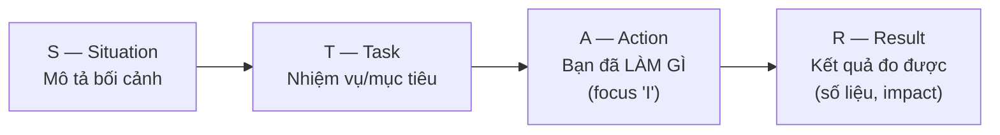

# 🎭 Behavioral Questions — STAR Method

> AI Engineer interviews luôn có phần behavioral. Dùng **STAR method** để trả lời có cấu trúc.

---

## STAR Framework

---

## 20 Câu Hỏi Behavioral + Gợi Ý

### Leadership & Teamwork

**1. "Tell me about a time you led a project."**
→ STAR: Mô tả project, vai trò lead, challenges gặp phải, kết quả (metrics).

**2. "Describe a conflict with a teammate. How did you resolve it?"**
→ Focus: Active listening, finding common ground, compromise. KHÔNG blame.

**3. "How do you handle disagreements about technical approaches?"**
→ Data-driven: benchmark, A/B test, prototype cả 2 approaches rồi compare.

### Problem Solving

**4. "Tell me about a difficult bug you fixed."**
→ Mô tả: symptoms → diagnosis process → root cause → fix → prevention.

**5. "Describe a time you had to learn a new technology quickly."**
→ Approach: official docs → tutorials → build small project → apply to real problem.

**6. "How do you handle ambiguous requirements?"**
→ Ask clarifying questions, propose assumptions, build MVP, iterate with feedback.

### Failure & Growth

**7. "Tell me about a project that failed. What did you learn?"**
→ Be honest about failure. Focus on LEARNINGS, not excuses. Show growth.

**8. "Describe a mistake you made and how you handled it."**
→ Acknowledge → fix → prevent recurrence. Show ownership.

**9. "How do you handle feedback?"**
→ Welcome it, separate emotion from content, implement actionable items.

### Time Management

**10. "How do you prioritize when everything is urgent?"**
→ Eisenhower matrix: Urgent+Important first. Communicate trade-offs. Say no to non-essentials.

**11. "Tell me about a time you had a tight deadline."**
→ Scope reduction, parallel work, clear communication, deliver MVP first.

### AI-Specific

**12. "Describe an ML model you built. What was the hardest part?"**
→ Focus on: data quality, feature engineering, debugging, deployment. NOT just accuracy.

**13. "How do you stay up-to-date with AI research?"**
→ Papers (arXiv), blogs (Lilian Weng, Jay Alammar), Twitter/X, conferences (NeurIPS, ICML).

**14. "Tell me about a data quality issue you discovered."**
→ How you found it, impact on model, what you did, prevention measures.

**15. "How do you explain AI concepts to non-technical stakeholders?"**
→ Analogies, visualization, avoid jargon, focus on business impact.

**16. "Describe a time you optimized model performance."**
→ Profile → identify bottleneck → solution (quantization, caching, batching) → before/after metrics.

**17. "How do you decide between building vs buying?"**
→ Consider: cost, maintenance, customization needs, team expertise, timeline.

**18. "Tell me about a trade-off you made in a project."**
→ Accuracy vs latency, cost vs quality, build vs buy. Show decision-making process.

**19. "Why AI Engineering? What excites you?"**
→ Be genuine. Connect to specific technologies, projects, or impact you want to make.

**20. "Where do you see yourself in 3 years?"**
→ Show ambition but realistic. Technical depth + breadth. Mention specific areas (MLOps, agents, speech).

---

## 💡 Tips

1. **Chuẩn bị 5-7 stories** có thể adapt cho nhiều câu hỏi khác nhau
2. **Dùng số liệu**: "improved accuracy by 15%", "reduced latency from 2s to 200ms"
3. **Focus vào "I"**: Interviewer muốn biết BẠN làm gì, không phải team
4. **Be honest**: Nếu chưa có experience, nói về side projects hoặc learning
5. **Ask for time**: "Let me think about that for a moment" — hoàn toàn OK

---

## 🌟 STAR Example Answers (Mẫu chi tiết)

### Example 1: "Tell me about a difficult bug you fixed."

> **S**: Trong project RAG chatbot cho internal docs, model trả lời đúng khi dùng Postman nhưng sai khi users dùng qua frontend.
>
> **T**: Tôi cần identify root cause và fix trước deadline demo cho leadership (còn 2 ngày).
>
> **A**: (1) So sánh requests giữa Postman vs frontend → phát hiện frontend encode Unicode khác, gây tokenization shift. (2) Thêm text normalization layer trước khi gửi vào model. (3) Viết unit test cover 15 edge cases (emoji, tiếng Việt có dấu, special chars).
>
> **R**: Fix trong 4 giờ, demo thành công, chatbot accuracy tăng từ 78% → 93% trên tiếng Việt. Team adopt text normalization làm standard cho tất cả pipelines.

### Example 2: "Describe a time you had to learn a new technology quickly."

> **S**: Company quyết định dùng LangGraph cho agent system. Không ai trong team có experience, và project deadline là 3 tuần.
>
> **T**: Tôi volunteer làm POC (proof of concept) và train lại team.
>
> **A**: (1) Tuần 1: Đọc docs + official tutorials, build 3 mini projects (chat agent, RAG agent, multi-tool agent). (2) Tuần 2: Build production POC với error handling, memory, actual tools. (3) Tạo internal guide 20 trang + 1h workshop cho team.
>
> **R**: POC hoàn thành đúng hạn. Team 4 người onboard trong 3 ngày thay vì dự kiến 2 tuần. LangGraph trở thành standard framework cho tất cả agent projects.

### Example 3: "Tell me about a trade-off you made in a project."

> **S**: Deploy speech-to-text system cho call center, server budget giới hạn (no GPU). Whisper large accurate nhưng chậm (10x real-time trên CPU).
>
> **T**: Cần đạt WER < 15% với latency < 2x real-time trên CPU.
>
> **A**: (1) Benchmark 4 model sizes: large (WER 8%, 10x RT), medium (WER 11%, 4x RT), small (WER 16%, 1.5x RT), distil-medium (WER 12%, 2x RT). (2) Chọn distil-medium + CTranslate2 quantization INT8. (3) Thêm domain-specific vocabulary boosting cho ngành y tế.
>
> **R**: Final: WER 11.5% (< target 15%), latency 1.8x RT (< target 2x). Saved $2,000/month vs GPU option. System đang serve 500 calls/day.

---

## 🎯 Interview Tips — Chi Tiết

### Q1: "Bao nhiêu stories cần chuẩn bị?"
**A**: 5-7 stories chính, mỗi story có thể adapt cho 3-4 câu hỏi khác nhau. Cover: (1) leadership, (2) failure + learning, (3) technical challenge, (4) teamwork conflict, (5) tight deadline, (6) AI-specific achievement.

### Q2: "Nếu chưa có work experience?"
**A**: Dùng: (1) Side projects (Kaggle competitions, personal AI tools). (2) University projects (thesis, group projects). (3) Open-source contributions. (4) Hackathons. Key: phải có measurable results.

### Q3: "Nên dài hay ngắn?"
**A**: Rule of 2 minutes: mỗi answer nên 1.5-2 phút. S+T = 30s (ngắn gọn bối cảnh). A = 60s (phần QUAN TRỌNG NHẤT — chi tiết bạn làm gì). R = 30s (kết quả + số liệu).

### Q4: "Red flags cần tránh?"
**A**: (1) Blame team/manager. (2) Nói "we" thay vì "I". (3) Không có metrics/kết quả cụ thể. (4) Quá dài, lan man. (5) Nói "I don't have that experience" thay vì adapt story gần nhất.

### Q5: "Follow-up questions thường gặp?"
**A**: "What would you do differently?" — luôn chuẩn bị sẵn. "How did the team react?" — show collaboration. "What was the long-term impact?" — show thinking beyond immediate task.

### Q6: "Cách practice hiệu quả?"
**A**: (1) Viết ra 7 stories theo STAR template. (2) Record bản thân trả lời. (3) Time mỗi answer (target 2 min). (4) Mock interview với bạn bè. (5) Luyện nói "I" thay "we".
