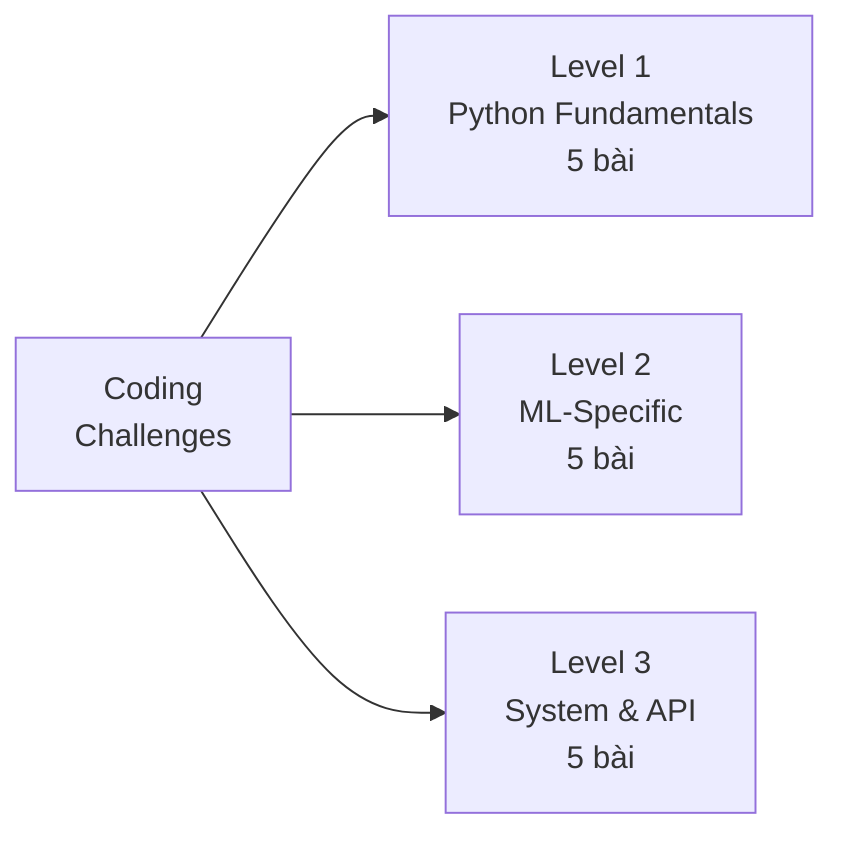

# 💻 Coding Challenges cho AI Engineer

> 15 bài tập coding thực tế — từ data structures đến ML-specific đến API design.
> **Mỗi bài có solution hoàn chỉnh + giải thích complexity.**

## Coding Challenge Categories



---

## Level 1: Python Fundamentals (5 bài)

### Challenge 1: Implement LRU Cache
```python
# Implement a Least Recently Used (LRU) cache with O(1) get/put
# Hint: OrderedDict hoặc dict + doubly linked list

class LRUCache:
    def __init__(self, capacity: int):
        self.capacity = capacity
        self.cache = OrderedDict()
    
    def get(self, key: int) -> int:
        if key not in self.cache:
            return -1
        self.cache.move_to_end(key)  # Mark as recently used
        return self.cache[key]
    
    def put(self, key: int, value: int) -> None:
        if key in self.cache:
            self.cache.move_to_end(key)
        self.cache[key] = value
        if len(self.cache) > self.capacity:
            self.cache.popitem(last=False)  # Remove oldest

# Complexity: O(1) get, O(1) put — OrderedDict uses doubly-linked list + hashmap

# Test
cache = LRUCache(2)
cache.put(1, 1)
cache.put(2, 2)
assert cache.get(1) == 1
cache.put(3, 3)       # evicts key 2
assert cache.get(2) == -1
```

### Challenge 2: Rate Limiter
```python
# Implement a sliding window rate limiter
# Allow max N requests per T seconds

import time
from collections import deque

class RateLimiter:
    def __init__(self, max_requests: int, window_seconds: float):
        self.max_requests = max_requests
        self.window = window_seconds
        self.timestamps = deque()
    
    def allow_request(self) -> bool:
        """Sliding window: remove expired, check count."""
        now = time.time()
        # Remove timestamps outside window
        while self.timestamps and self.timestamps[0] <= now - self.window:
            self.timestamps.popleft()
        if len(self.timestamps) < self.max_requests:
            self.timestamps.append(now)
            return True
        return False

# Complexity: O(1) amortized — each timestamp added/removed once

# Test
limiter = RateLimiter(max_requests=3, window_seconds=1.0)
assert limiter.allow_request() == True
assert limiter.allow_request() == True
assert limiter.allow_request() == True
assert limiter.allow_request() == False  # Rate limited!
```

### Challenge 3: Async Batch Processor
```python
# Process items in batches asynchronously
# Input: list of URLs, batch_size
# Output: list of responses (maintain order)

import asyncio
import aiohttp

async def fetch_one(session: aiohttp.ClientSession, url: str) -> dict:
    """Fetch a single URL with error handling."""
    try:
        async with session.get(url, timeout=aiohttp.ClientTimeout(total=10)) as resp:
            return {"url": url, "status": resp.status, "data": await resp.text()}
    except Exception as e:
        return {"url": url, "status": -1, "error": str(e)}

async def batch_process(urls: list[str], batch_size: int = 5) -> list[dict]:
    """Fetch URLs in parallel batches, maintain original order."""
    results = []
    async with aiohttp.ClientSession() as session:
        for i in range(0, len(urls), batch_size):
            batch = urls[i:i + batch_size]
            batch_results = await asyncio.gather(
                *[fetch_one(session, url) for url in batch]
            )
            results.extend(batch_results)
    return results

# Complexity: O(n/batch_size) batches, each batch O(batch_size) parallel
# Total wall-clock: O(n/batch_size * max_latency_per_batch)

# Test
async def test():
    urls = [f"https://httpbin.org/get?id={i}" for i in range(12)]
    results = await batch_process(urls, batch_size=4)
    assert len(results) == 12
    print(f"Fetched {len(results)} URLs in 3 batches")
```

### Challenge 4: Text Tokenizer (BPE-like)
```python
# Implement a simple word-level tokenizer with vocabulary
# that handles unknown tokens with subword fallback

class SimpleTokenizer:
    def __init__(self, vocab: dict[str, int]):
        self.vocab = vocab
        self.unk_token_id = 0
        self.id_to_token = {v: k for k, v in vocab.items()}
    
    def encode(self, text: str) -> list[int]:
        """Convert text → list of token IDs with char fallback."""
        tokens = text.lower().split()
        ids = []
        for token in tokens:
            if token in self.vocab:
                ids.append(self.vocab[token])
            else:
                # Subword fallback: split into characters
                for char in token:
                    ids.append(self.vocab.get(char, self.unk_token_id))
        return ids
    
    def decode(self, token_ids: list[int]) -> str:
        """Convert token IDs → text."""
        return " ".join(self.id_to_token.get(tid, "[UNK]") for tid in token_ids)

# Complexity: O(n * max_word_len) encode, O(n) decode

# Test
vocab = {"[UNK]": 0, "hello": 1, "world": 2, "a": 3, "i": 4}
tok = SimpleTokenizer(vocab)
assert tok.encode("hello world") == [1, 2]
assert tok.encode("hello ai") == [1, 3, 4]  # 'ai' → ['a', 'i']
assert tok.decode([1, 2]) == "hello world"
```

### Challenge 5: Decorator — Retry with Exponential Backoff
```python
# Implement a decorator that retries failed functions
# with exponential backoff (1s, 2s, 4s, 8s...)

import functools
import time
import random

def retry_with_backoff(max_retries: int = 3, base_delay: float = 1.0):
    """Decorator factory for retry with exponential backoff + jitter."""
    def decorator(func):
        @functools.wraps(func)
        def wrapper(*args, **kwargs):
            for attempt in range(max_retries + 1):
                try:
                    return func(*args, **kwargs)
                except Exception as e:
                    if attempt == max_retries:
                        raise  # Final attempt, re-raise
                    delay = base_delay * (2 ** attempt) + random.uniform(0, 0.5)
                    print(f"Attempt {attempt+1} failed: {e}. Retrying in {delay:.1f}s...")
                    time.sleep(delay)
        return wrapper
    return decorator

# Complexity: O(max_retries) worst case, with exponential wait

# Test
call_count = 0

@retry_with_backoff(max_retries=3, base_delay=0.01)  # small delay for test
def flaky_api_call():
    global call_count
    call_count += 1
    if call_count < 3:
        raise ConnectionError("Server unavailable")
    return "success"

assert flaky_api_call() == "success"
assert call_count == 3  # Failed 2x, succeeded on 3rd
```

---

## Level 2: ML-Specific (5 bài)

### Challenge 6: Cosine Similarity Search
```python
# Implement efficient cosine similarity search
# WITHOUT using sklearn (use only numpy)

import numpy as np

def cosine_search(query: np.ndarray, database: np.ndarray, top_k: int = 5) -> list[tuple]:
    """
    Returns top-k (index, similarity) pairs.
    query: (d,) vector
    database: (n, d) matrix
    """
    # Normalize query
    query_norm = query / (np.linalg.norm(query) + 1e-8)
    # Normalize all docs at once (vectorized)
    db_norms = np.linalg.norm(database, axis=1, keepdims=True) + 1e-8
    db_normalized = database / db_norms
    # Dot product = cosine similarity (both normalized)
    similarities = db_normalized @ query_norm  # (n,)
    # Get top-k indices
    top_indices = np.argsort(similarities)[-top_k:][::-1]
    return [(idx, float(similarities[idx])) for idx in top_indices]

# Complexity: O(n*d) — matrix multiplication
# Production: use FAISS/Annoy for O(log n) approximate search
```

### Challenge 7: Mini Gradient Descent
```python
# Implement gradient descent for linear regression from scratch

import numpy as np

def linear_regression_gd(X: np.ndarray, y: np.ndarray, 
                          lr: float = 0.01, epochs: int = 1000) -> tuple:
    """
    Returns (weights, bias, loss_history)
    """
    n_samples, n_features = X.shape
    weights = np.zeros(n_features)
    bias = 0.0
    loss_history = []
    
    for _ in range(epochs):
        # Forward
        y_pred = X @ weights + bias
        error = y_pred - y
        
        # MSE loss
        loss = np.mean(error ** 2)
        loss_history.append(loss)
        
        # Gradients
        dw = (2 / n_samples) * (X.T @ error)
        db = (2 / n_samples) * np.sum(error)
        
        # Update
        weights -= lr * dw
        bias -= lr * db
    
    return weights, bias, loss_history

# Complexity: O(epochs * n * d) — matrix multiplication per epoch
```

### Challenge 8: Confusion Matrix Calculator
```python
# Calculate precision, recall, F1, and confusion matrix
# WITHOUT using sklearn

def evaluate_classifier(y_true: list[int], y_pred: list[int]) -> dict:
    """
    Returns confusion matrix + metrics for binary classification.
    """
    TP = sum(1 for t, p in zip(y_true, y_pred) if t == 1 and p == 1)
    TN = sum(1 for t, p in zip(y_true, y_pred) if t == 0 and p == 0)
    FP = sum(1 for t, p in zip(y_true, y_pred) if t == 0 and p == 1)
    FN = sum(1 for t, p in zip(y_true, y_pred) if t == 1 and p == 0)
    
    precision = TP / (TP + FP) if (TP + FP) > 0 else 0.0
    recall = TP / (TP + FN) if (TP + FN) > 0 else 0.0
    f1 = 2 * precision * recall / (precision + recall) if (precision + recall) > 0 else 0.0
    accuracy = (TP + TN) / len(y_true)
    
    return {
        "confusion_matrix": [[TN, FP], [FN, TP]],
        "precision": round(precision, 4),
        "recall": round(recall, 4),
        "f1": round(f1, 4),
        "accuracy": round(accuracy, 4),
    }

# Complexity: O(n) — single pass through predictions
```

### Challenge 9: Simple TF-IDF
```python
# Implement TF-IDF from scratch

import math
from collections import Counter

def compute_tfidf(documents: list[str]) -> list[dict[str, float]]:
    """
    Returns list of dicts mapping word → TF-IDF score for each document.
    TF(t,d) = count(t in d) / len(d)
    IDF(t) = log(N / df(t)) where df = docs containing t
    """
    N = len(documents)
    tokenized = [doc.lower().split() for doc in documents]
    
    # Document frequency: how many docs contain each term
    df = Counter()
    for tokens in tokenized:
        for term in set(tokens):  # set() for unique terms per doc
            df[term] += 1
    
    # Compute TF-IDF per document
    results = []
    for tokens in tokenized:
        tf = Counter(tokens)
        doc_len = len(tokens)
        tfidf = {}
        for term, count in tf.items():
            tf_score = count / doc_len
            idf_score = math.log(N / df[term])
            tfidf[term] = round(tf_score * idf_score, 4)
        results.append(tfidf)
    
    return results

# Complexity: O(N * L) where L = avg doc length

# Test
docs = ["the cat sat", "the dog sat", "the cat played"]
scores = compute_tfidf(docs)
assert scores[0]["cat"] > 0       # 'cat' in 2/3 docs → some IDF
assert scores[0].get("the", 0) == 0  # 'the' in all docs → IDF = log(1) = 0
print(scores[0])  # {'the': 0.0, 'cat': 0.1352, 'sat': 0.1352}
```

### Challenge 10: K-Means Clustering
```python
# Implement K-Means from scratch

import numpy as np

def kmeans(X: np.ndarray, k: int, max_iters: int = 100) -> tuple:
    """
    Returns (centroids, labels)
    X: (n_samples, n_features)
    """
    n_samples, n_features = X.shape
    
    # Random initialization: pick k random samples as centroids
    indices = np.random.choice(n_samples, k, replace=False)
    centroids = X[indices].copy()
    
    for _ in range(max_iters):
        # Assignment: each point → nearest centroid
        distances = np.linalg.norm(X[:, np.newaxis] - centroids, axis=2)  # (n, k)
        labels = np.argmin(distances, axis=1)  # (n,)
        
        # Update: new centroids = mean of assigned points
        new_centroids = np.array([
            X[labels == i].mean(axis=0) if np.sum(labels == i) > 0 
            else centroids[i]  # Keep old if no points assigned
            for i in range(k)
        ])
        
        # Convergence check
        if np.allclose(centroids, new_centroids, atol=1e-6):
            break
        centroids = new_centroids
    
    return centroids, labels

# Complexity: O(max_iters * n * k * d)

# Test
from sklearn.datasets import make_blobs
X, y_true = make_blobs(n_samples=300, centers=3, random_state=42)
centroids, labels = kmeans(X, k=3)
assert len(np.unique(labels)) == 3
print(f"Found {len(np.unique(labels))} clusters")
```

---

## Level 3: System & API Design (5 bài)

### Challenge 11: Build a Simple RAG Pipeline
```python
# Build a minimal RAG pipeline using numpy + openai

import numpy as np
from openai import OpenAI

class MiniRAG:
    def __init__(self, client: OpenAI):
        self.client = client
        self.chunks: list[str] = []
        self.embeddings: list[np.ndarray] = []
    
    def _embed(self, text: str) -> np.ndarray:
        """Get embedding from OpenAI."""
        resp = self.client.embeddings.create(input=text, model="text-embedding-3-small")
        return np.array(resp.data[0].embedding)
    
    def add_document(self, text: str, chunk_size: int = 500):
        """Chunk text and embed each chunk."""
        words = text.split()
        for i in range(0, len(words), chunk_size):
            chunk = " ".join(words[i:i + chunk_size])
            self.chunks.append(chunk)
            self.embeddings.append(self._embed(chunk))
    
    def query(self, question: str, top_k: int = 3) -> str:
        """Search → Retrieve → Generate."""
        # 1. Embed query
        q_emb = self._embed(question)
        
        # 2. Cosine similarity search
        db = np.array(self.embeddings)
        sims = db @ q_emb / (np.linalg.norm(db, axis=1) * np.linalg.norm(q_emb) + 1e-8)
        top_idx = np.argsort(sims)[-top_k:][::-1]
        
        # 3. Format context + generate
        context = "\n---\n".join(self.chunks[i] for i in top_idx)
        resp = self.client.chat.completions.create(
            model="gpt-4o-mini",
            messages=[
                {"role": "system", "content": f"Answer based on context:\n{context}"},
                {"role": "user", "content": question},
            ],
        )
        return resp.choices[0].message.content

# Complexity: O(n*d) search, O(1) generation
# Production: replace numpy search with FAISS/Qdrant
```

### Challenge 12: FastAPI ML Serving Endpoint
```python
# Complete FastAPI app with model serving + health check + rate limiting

from fastapi import FastAPI, HTTPException, Request
from pydantic import BaseModel, Field
import joblib
import time
from collections import deque

app = FastAPI(title="ML Serving API")

# --- Rate Limiter ---
class RateLimiter:
    def __init__(self, max_requests: int = 100, window: int = 60):
        self.max_requests = max_requests
        self.window = window
        self.requests: dict[str, deque] = {}
    
    def check(self, client_ip: str) -> bool:
        now = time.time()
        if client_ip not in self.requests:
            self.requests[client_ip] = deque()
        q = self.requests[client_ip]
        while q and q[0] < now - self.window:
            q.popleft()
        if len(q) >= self.max_requests:
            return False
        q.append(now)
        return True

limiter = RateLimiter(max_requests=100, window=60)
model = None

# --- Startup ---
@app.on_event("startup")
async def load_model():
    global model
    model = joblib.load("model.pkl")

# --- Schemas ---
class PredictRequest(BaseModel):
    features: list[float] = Field(..., min_length=1)

class PredictResponse(BaseModel):
    prediction: float
    latency_ms: float

# --- Endpoints ---
@app.get("/health")
async def health():
    return {"status": "healthy", "model_loaded": model is not None}

@app.post("/predict", response_model=PredictResponse)
async def predict(req: PredictRequest, request: Request):
    if not limiter.check(request.client.host):
        raise HTTPException(429, "Rate limit exceeded")
    if model is None:
        raise HTTPException(503, "Model not loaded")
    
    start = time.perf_counter()
    try:
        pred = model.predict([req.features])[0]
    except Exception as e:
        raise HTTPException(400, f"Prediction failed: {e}")
    latency = (time.perf_counter() - start) * 1000
    
    return PredictResponse(prediction=float(pred), latency_ms=round(latency, 2))

# Complexity: O(1) rate check, O(model) prediction
```

### Challenge 13: Data Pipeline with Validation
```python
# Production data pipeline with schema validation

import pandas as pd
import numpy as np
from dataclasses import dataclass

@dataclass
class ColumnSpec:
    name: str
    dtype: str          # 'numeric', 'categorical', 'datetime'
    required: bool = True
    min_val: float = None
    max_val: float = None
    allowed_values: list = None

class DataPipeline:
    def __init__(self, schema: list[ColumnSpec]):
        self.schema = {s.name: s for s in schema}
        self.errors: list[str] = []
    
    def validate(self, df: pd.DataFrame) -> bool:
        """Validate dataframe against schema."""
        self.errors = []
        for name, spec in self.schema.items():
            if name not in df.columns:
                if spec.required:
                    self.errors.append(f"Missing required column: {name}")
                continue
            if spec.min_val is not None:
                violations = df[name] < spec.min_val
                if violations.any():
                    self.errors.append(f"{name}: {violations.sum()} values below {spec.min_val}")
            if spec.allowed_values:
                invalid = ~df[name].isin(spec.allowed_values)
                if invalid.any():
                    self.errors.append(f"{name}: {invalid.sum()} invalid categories")
        return len(self.errors) == 0
    
    def clean(self, df: pd.DataFrame) -> pd.DataFrame:
        """Handle missing values + transform features."""
        df = df.copy()
        for name, spec in self.schema.items():
            if name not in df.columns:
                continue
            if spec.dtype == "numeric":
                df[name] = pd.to_numeric(df[name], errors="coerce")
                df[name].fillna(df[name].median(), inplace=True)
            elif spec.dtype == "categorical":
                df[name].fillna("UNKNOWN", inplace=True)
        return df
    
    def run(self, df: pd.DataFrame) -> pd.DataFrame:
        """Full pipeline: validate → clean → return."""
        if not self.validate(df):
            raise ValueError(f"Validation failed: {self.errors}")
        return self.clean(df)

# Test
schema = [
    ColumnSpec("age", "numeric", min_val=0, max_val=150),
    ColumnSpec("income", "numeric", min_val=0),
    ColumnSpec("category", "categorical", allowed_values=["A", "B", "C"]),
]
pipeline = DataPipeline(schema)
df = pd.DataFrame({"age": [25, None, 30], "income": [50000, 60000, None], "category": ["A", "B", "D"]})
# pipeline.run(df)  # Raises: category has 1 invalid value
```

### Challenge 14: Token Counter & Cost Estimator
```python
# Token counting + cost estimation across models

import tiktoken

class CostEstimator:
    PRICING = {  # per 1M tokens
        "gpt-4o": {"input": 2.50, "output": 10.00},
        "gpt-4o-mini": {"input": 0.15, "output": 0.60},
        "claude-3.5-sonnet": {"input": 3.00, "output": 15.00},
    }
    
    def __init__(self):
        self.encoder = tiktoken.encoding_for_model("gpt-4o")
    
    def count_tokens(self, text: str) -> int:
        """Count tokens using tiktoken."""
        return len(self.encoder.encode(text))
    
    def estimate(self, prompt: str, model: str, expected_output_tokens: int = 500) -> dict:
        """Estimate cost for a single request."""
        if model not in self.PRICING:
            raise ValueError(f"Unknown model: {model}. Available: {list(self.PRICING.keys())}")
        
        input_tokens = self.count_tokens(prompt)
        pricing = self.PRICING[model]
        
        input_cost = (input_tokens / 1_000_000) * pricing["input"]
        output_cost = (expected_output_tokens / 1_000_000) * pricing["output"]
        
        return {
            "model": model,
            "input_tokens": input_tokens,
            "output_tokens": expected_output_tokens,
            "input_cost": round(input_cost, 6),
            "output_cost": round(output_cost, 6),
            "total_cost": round(input_cost + output_cost, 6),
        }
    
    def compare_models(self, prompt: str, output_tokens: int = 500) -> list[dict]:
        """Compare costs across all models."""
        return sorted(
            [self.estimate(prompt, m, output_tokens) for m in self.PRICING],
            key=lambda x: x["total_cost"],
        )

# Test
est = CostEstimator()
prompt = "Explain the transformer architecture in detail." * 50
results = est.compare_models(prompt, output_tokens=1000)
for r in results:
    print(f"{r['model']:25s} | {r['input_tokens']} in | ${r['total_cost']:.6f}")

# Complexity: O(n) tokenization where n = text length
```

### Challenge 15: Streaming Response Handler
```python
# Streaming handler with token tracking + timeout + error handling

import asyncio
import time
from dataclasses import dataclass, field
from openai import AsyncOpenAI

@dataclass
class StreamStats:
    tokens: int = 0
    first_token_ms: float = 0
    total_ms: float = 0
    tokens_per_second: float = 0

class StreamHandler:
    def __init__(self, client: AsyncOpenAI, timeout: float = 30.0):
        self.client = client
        self.timeout = timeout
        self.stats = StreamStats()
    
    async def stream(self, prompt: str, model: str = "gpt-4o-mini"):
        """Stream tokens from LLM with stats tracking."""
        start = time.perf_counter()
        first_token = True
        
        try:
            response = await asyncio.wait_for(
                self.client.chat.completions.create(
                    model=model,
                    messages=[{"role": "user", "content": prompt}],
                    stream=True,
                ),
                timeout=self.timeout,
            )
            
            async for chunk in response:
                if chunk.choices[0].delta.content:
                    token = chunk.choices[0].delta.content
                    self.stats.tokens += 1
                    
                    if first_token:
                        self.stats.first_token_ms = (time.perf_counter() - start) * 1000
                        first_token = False
                    
                    yield token
                    
        except asyncio.TimeoutError:
            yield "\n[ERROR: Stream timeout]"
        except Exception as e:
            yield f"\n[ERROR: {str(e)}]"
        finally:
            elapsed = time.perf_counter() - start
            self.stats.total_ms = elapsed * 1000
            self.stats.tokens_per_second = (
                self.stats.tokens / elapsed if elapsed > 0 else 0
            )
    
    def get_stats(self) -> dict:
        return {
            "tokens": self.stats.tokens,
            "first_token_ms": round(self.stats.first_token_ms, 1),
            "total_ms": round(self.stats.total_ms, 1),
            "tokens_per_second": round(self.stats.tokens_per_second, 1),
        }

# Complexity: O(n) where n = output tokens, streaming = O(1) per token
```

---

## 💡 Tips khi giải

1. **Hỏi clarify**: Edge cases, scale, constraints trước khi code
2. **Start simple**: Brute force trước, optimize sau
3. **Test cases**: Viết test trước hoặc cùng lúc
4. **Time complexity**: Luôn nêu Big-O
5. **Production mindset**: Error handling, logging, type hints
6. **Explain trade-offs**: "I chose X over Y because..."
