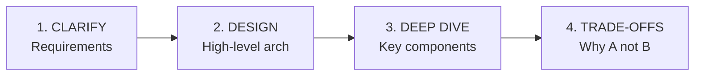
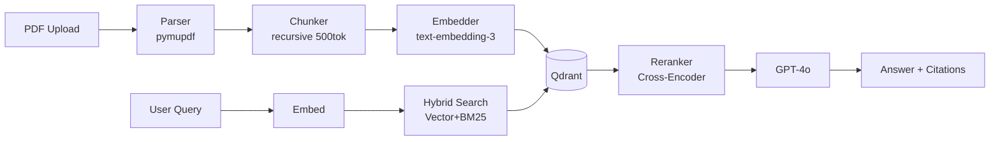
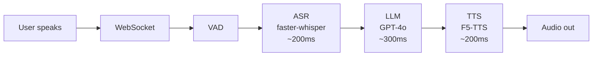
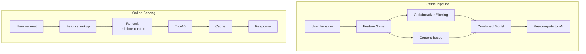
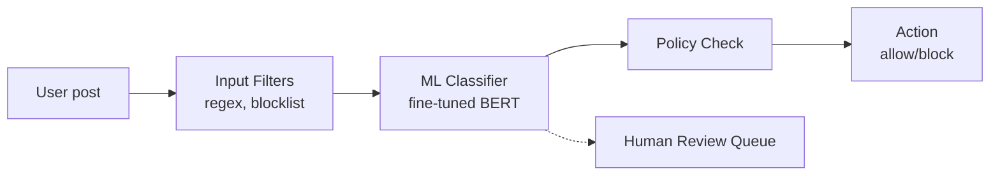
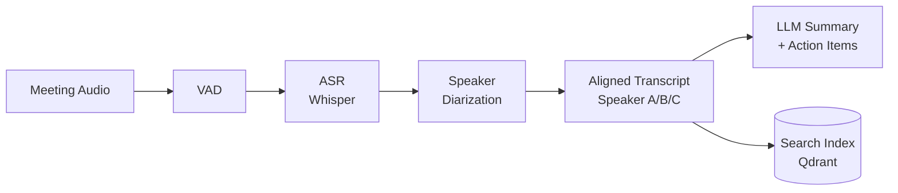
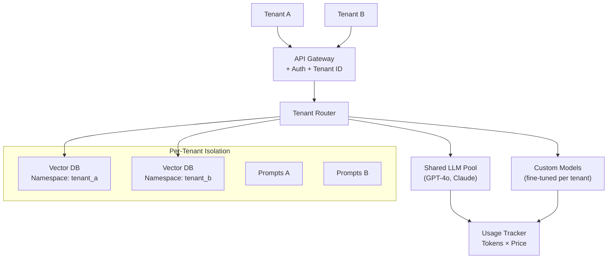

# 🏗️ System Design Case Studies cho AI Engineer

> 5 case studies chi tiết — cách approach "Design a ____ system" trong phỏng vấn.

---

## Framework Chung (4 bước)



---

## Case 1: Document Q&A System (RAG)

> "Design a Q&A system for a legal firm with 10,000 documents."

### Requirements
- **Functional**: Upload docs, ask questions, get answers with citations
- **Non-functional**: <3s latency, accurate (no hallucination), multi-user

### Architecture



### Key Decisions
- **Chunking**: Recursive 500 tokens, 50 overlap. Legal docs have clear sections → use headings as split points
- **Retrieval**: Hybrid search because legal terms need exact keyword match (BM25) + semantic (vector)
- **Reranking**: Cross-encoder reranker for Top-K precision — critical for legal accuracy
- **Multi-tenancy**: Metadata filtering `where org_id = X`
- **Cost**: Cache frequent queries, use GPT-4o-mini cho simple questions

---

## Case 2: Real-Time Voice Agent

> "Design a voice AI agent for customer service. Latency < 1 second."

### Architecture



### Latency Budget
| Component | Target | Optimization |
|-----------|--------|-------------|
| ASR | <300ms | faster-whisper INT8, streaming |
| LLM | <500ms | GPT-4o-mini, streaming, short prompts |
| TTS | <300ms | F5-TTS streaming, first-chunk priority |

### Key Decisions
- **Barge-in**: User có thể ngắt lời → cancel current TTS, restart pipeline
- **Streaming**: Mỗi component stream output → component tiếp theo bắt đầu sớm
- **Fallback**: If ASR confidence < 0.7 → ask user to repeat
- **Cost**: Track tokens/minute/call, auto-timeout after 10 min

---

## Case 3: Recommendation Engine

> "Design a product recommendation system for e-commerce (1M users, 100K products)."

### Architecture



### Key Decisions
- **Cold start**: New users → content-based (popular items). New items → content features
- **Two-stage**: Candidate generation (fast, recall) → Ranking (accurate, precision)
- **Features**: User history, item attributes, contextual (time, device, location)
- **A/B testing**: CTR, conversion rate, revenue per user, engagement time
- **Scaling**: Pre-compute offline, serve from cache, update daily

---

## Case 4: Content Moderation Pipeline

> "Design an automated content moderation system for a social media platform."

### Architecture



### Layers
1. **Input filters**: Regex for known bad patterns, blocklist
2. **ML classifier**: Multi-label (hate, violence, sexual, spam) — fine-tuned BERT
3. **LLM judge**: For borderline cases, GPT-4o with detailed rubric
4. **Human review**: Flagged content → human moderator queue
5. **Appeals**: User can appeal → re-review

### Key Decisions
- **Precision vs Recall**: High recall (catch bad content) but moderate precision (minimize false positive → user frustration)
- **Latency**: <100ms for classifier, 1-2s for LLM judge (async)
- **Multi-language**: Use multilingual model (XLM-R) or translate-first
- **Adversarial**: Unicode tricks, leetspeak, images with text → need multimodal

---

## Case 5: Meeting Intelligence Engine

> "Design a system that transcribes meetings, identifies speakers, and generates summaries."

### Architecture



### Key Decisions
- **Real-time vs Post-processing**: Post-processing cho accuracy. Real-time cho live captions
- **Speaker diarization**: Pyannote 3.0, handle speaker overlap, min 2s per segment
- **Summarization**: Hierarchical — summarize chunks first, then overall summary
- **Action items**: Extract with structured output (assignee, deadline, task)
- **Search**: Embed transcript chunks → semantic search across all meetings

---

## 📊 Capacity Estimation Cheat Sheet

> Interviewer thường hỏi **"How would you scale this?"** — cần biết back-of-envelope math.

| Metric | Formula | Example |
|--------|---------|---------|
| **QPS** | Users × Requests/day / 86,400 | 1M users × 5 req/day = ~58 QPS |
| **Storage** | Documents × Avg size × Retention | 10K docs × 5MB × 2 years = 100GB |
| **Embedding storage** | Chunks × Dim × 4 bytes | 500K chunks × 1536 × 4 = ~3GB |
| **LLM cost/month** | QPS × 86,400 × 30 × $/request | 58 × 86,400 × 30 × $0.003 = ~$450K |
| **Bandwidth** | QPS × Response size | 58 × 2KB = 116KB/s ≈ trivial |

### Cost Optimization Patterns

```
1. Caching      → Redis/Memcached cho frequent queries (80/20 rule)
2. Model tiering → GPT-4o-mini cho simple, GPT-4o cho complex
3. Batching     → Batch embedding requests (reduce API calls 10x)
4. Async        → Queue non-urgent tasks (summary generation)
5. Edge         → Pre-compute popular results, serve from CDN
```

---

## ⚖️ Common Trade-offs (phải giải thích được)

| Trade-off | Option A | Option B | When to choose A |
|-----------|----------|----------|-----------------|
| **Accuracy vs Latency** | GPT-4o (accurate, slow) | GPT-4o-mini (fast, cheaper) | Legal, medical = accuracy first |
| **Real-time vs Batch** | Streaming inference | Pre-compute + cache | User-facing = real-time |
| **Build vs Buy** | Custom model | API (OpenAI) | Control, privacy, cost at scale |
| **Precision vs Recall** | High precision | High recall | Moderation = recall. Search = precision |
| **Monolith vs Microservice** | Single service | Separate services | Start monolith → split when needed |

---

## 🎯 Interview Tips — Chi Tiết

### Q1: "System design interview allocation thời gian?"
**A**: 5 min clarify requirements → 10 min high-level design → 15 min deep dive key components → 5 min trade-offs + scaling. Total ~35 min.

### Q2: "Nên vẽ gì trên whiteboard?"
**A**: (1) Data flow diagram (input → processing → output). (2) Component boxes with tech choices. (3) Database schemas nếu cần. (4) Latency budget table.

### Q3: "Interviewer hỏi 'How would you scale this?'"
**A**: (1) Horizontal scaling (more instances). (2) Caching layers (Redis). (3) Async processing (queue). (4) Database sharding. (5) CDN cho static. (6) Read replicas.

### Q4: "Nên chọn tech stack specific hay generic?"
**A**: Specific + explain WHY. "I'd use Qdrant for vector DB because..." not "some vector database". Shows real experience.

### Q5: "Monitoring & observability answer thế nào?"
**A**: (1) Metrics: latency p50/p95/p99, QPS, error rate. (2) Logging: structured logs (JSON). (3) Tracing: distributed tracing (Jaeger). (4) Alerting: PagerDuty + Slack.

### Q6: "Nếu không biết answer 1 component?"
**A**: Be honest: "I haven't worked with X directly, but based on my understanding..." → propose reasonable approach → ask interviewer for hints. Shows intellectual honesty.

---

## Case 6: Multi-Tenant AI Platform

### Requirements
- SaaS platform: multiple companies use the same AI infrastructure
- Each tenant: custom data, custom prompts, isolated conversations
- Cost allocation: track usage per tenant for billing

### Architecture



### Key Decisions

```
1. Model per tenant vs Shared model?
   ├── Shared + system prompt: 90% of cases (cheapest, simplest)
   ├── Fine-tuned per tenant: when custom style/format needed
   └── Dedicated instances: enterprise, compliance requirements

2. Data isolation:
   ├── Vector DB namespaces: Qdrant collections per tenant
   ├── DB: Row-Level Security (tenant_id column)
   └── File storage: S3 prefix per tenant (s3://bucket/tenant_id/*)

3. Cost allocation:
   ├── Track: input_tokens, output_tokens, model_used PER REQUEST
   ├── Associate each request with tenant_id
   └── Billing: monthly invoice = Σ(tokens × price_per_model)

4. Prompt leakage prevention:
   ├── System prompts stored server-side (never sent to client)
   ├── RAG context filtered by tenant_id BEFORE injection
   └── Output filtering: ensure no cross-tenant data in responses
```
