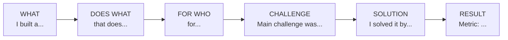

# 🎤 Portfolio Presentation — Cách Trình Bày Dự Án

> Hướng dẫn trình bày portfolio **gây ấn tượng** với interviewer.

---

## 1. "Tell Me About Your Project" Framework

### 30-Second Elevator Pitch



### Ví dụ:

> "I built a **RAG-based document Q&A system** for a legal firm that answers questions 
> from 10,000 contracts. The main challenge was **retrieval accuracy** — keyword search 
> missed semantic matches. I solved it by implementing **hybrid search (vector + BM25)** 
> with cross-encoder reranking. Result: **faithfulness improved from 0.7 to 0.94**, 
> reducing lawyer review time by 3 hours/day."

---

## 2. Cấu Trúc Trình Bày (5 phút)

### Minute 1: Problem & Context
- **Problem**: Mô tả vấn đề thực tế (business context)
- **Why it matters**: Impact nếu giải quyết được
- **Your role**: Bạn làm gì trong project

### Minute 2: Architecture
- **Vẽ diagram**: High-level architecture (3-5 components)
- **Tech stack**: List tools/frameworks đã dùng
- **Data flow**: Input → Processing → Output

### Minute 3: The Hard Part
- **Challenge**: Vấn đề kỹ thuật khó nhất
- **What you tried**: Approaches đã thử (bao gồm cả thất bại)
- **Solution**: Approach cuối cùng và **tại sao** nó hoạt động

### Minute 4: Results & Metrics
- **Quantitative**: Accuracy, latency, cost, user engagement
- **Qualitative**: User feedback, maintainability
- **Before → After**: So sánh trước và sau solution

### Minute 5: Lessons & Next Steps
- **What you learned**: Technical insights, soft skills
- **What you'd do differently**: Show growth mindset
- **Next steps**: Features muốn thêm, improvements

---

## 3. README Template cho Portfolio Project

```markdown
# 🚀 Project Name

> One-line description

## Problem
- What problem does this solve?
- Who is the target user?

## Demo


## Architecture
```
[Diagram]
```

## Tech Stack
| Component | Technology |
|-----------|-----------|
| Backend   | FastAPI    |
| ML Model  | GPT-4o + RAG |
| Vector DB | Qdrant     |
| Deploy    | Docker + GCP |

## Key Features
- ✅ Feature 1
- ✅ Feature 2

## Results
| Metric | Before | After |
|--------|--------|-------|
| Accuracy | 0.70 | 0.94 |
| Latency | 5s | 1.2s |

## Quick Start
```bash
git clone ...
pip install -r requirements.txt
python main.py
```

## Lessons Learned
- Key insight 1
- Key insight 2
```

---

## 4. Demo Recording Tips

### Tools
- **Screen recording**: OBS Studio (free), Loom (quick share)
- **Terminal**: Rich library cho beautiful output
- **Diagrams**: Mermaid, Excalidraw, draw.io

### Best Practices
1. **Script trước**: Viết sẵn scenario, không improvise
2. **Max 3 phút**: Short attention span. Hook trong 10 giây đầu
3. **Show failure → success**: "Initially, accuracy was 70%. After implementing X, it reached 94%"
4. **Real data**: Dùng real (hoặc realistic) data, không dummy
5. **Clean UI**: Nếu có frontend, làm cho đẹp (dark mode, animations)

---

## 5. Anti-Patterns (Tránh!)

| ❌ Don't | ✅ Do |
|----------|-------|
| "I followed a tutorial" | "I adapted approach X for problem Y" |
| "Team did everything" | "My specific contribution was..." |
| "It works perfectly" | "Main limitation is... I would improve by..." |
| Show only accuracy | Show architecture, challenges, trade-offs |
| Generic README | Detailed README with demo, metrics, setup |
| Todo app or calculator | Domain-specific AI project (healthcare, legal, finance) |

---

## 6. GitHub Profile Optimization

```markdown
# Checklist cho GitHub Profile Interview-Ready

## Profile
- [ ] Professional photo
- [ ] Bio: "AI Engineer | ML/NLP/RAG/Agents"
- [ ] Pinned repos: top 4-6 projects (best first)
- [ ] README.md profile with tech stack badges

## Each Project Repo
- [ ] Descriptive name (không "project-1", "test")
- [ ] README với architecture diagram
- [ ] Clean commit history (conventional commits)
- [ ] requirements.txt / pyproject.toml
- [ ] .github/workflows/ (CI/CD = bonus points)
- [ ] No API keys in code (dùng .env + .gitignore)

## Activity Signals
- [ ] Consistent green squares (contributions graph)
- [ ] Stars/forks từ community (share on social media)
- [ ] Open source contributions (even small PRs count)
```

### Profile README Example

```markdown
# Hi, I'm [Name] 👋

🔭 AI Engineer focused on **LLM Applications, RAG, and AI Agents**

## 🛠️ Tech Stack


## 📊 Featured Projects
| Project | Description | Stack |
|---------|-------------|-------|
| **Legal RAG** | Q&A over 10K contracts | Qdrant + GPT-4o |
| **Voice Agent** | Real-time conversation | Whisper + TTS |
```

---

## 7. Blog/Writing as Portfolio

```
Why writing matters for AI Engineers:
1. Demonstrates deep understanding (can't write clearly about what you don't understand)
2. SEO brings recruiters to YOU
3. Shows communication skills (critical for senior roles)
4. Builds personal brand

Blog Topic Ideas:
├── "How I Built X" (end-to-end walkthroughs)
├── "X vs Y for Production AI" (comparison posts)
├── "Lessons from Deploying LLMs" (war stories)
├── "Debugging [framework] Issue" (technical deep dives)
└── "Paper Explained: [paper name]" (research summaries)

Platforms (pick 1-2):
├── dev.to       → Developer community, great SEO
├── Medium       → Broader reach, paywall option
├── hashnode.dev → Custom domain, developer-focused
└── GitHub Pages → Full control, shows technical ability
```

---

## 🎯 Interview Tips — Chi Tiết

### Q1: "Why did you choose this architecture?"
**A**: Compare 2-3 alternatives. Example: "I considered fine-tuning vs RAG. RAG was better because: (1) data changes frequently, (2) no GPU budget for training, (3) need source citations. Trade-off: higher latency (1.5s vs 0.5s) but worth it for accuracy."

### Q2: "What would you do differently?"
**A**: Show growth mindset. Example: "I'd add evaluation earlier — we built features for 2 weeks before measuring quality. Also, I'd use structured logging from day 1 instead of print statements."

### Q3: "How would you scale this to 1M users?"
**A**: (1) Caching (Redis for frequent queries). (2) Async processing (background tasks for heavy jobs). (3) Horizontal scaling (multiple API instances behind load balancer). (4) Vector DB partitioning. (5) CDN for static assets.

### Q4: "What's the biggest risk of your system?"
**A**: Be honest. "Hallucination for edge cases not in our knowledge base. Mitigation: (1) Confidence scoring. (2) Source citations. (3) Human review for low-confidence answers. (4) Guardrails for sensitive topics."

### Q5: "How do you evaluate your model?"
**A**: "Golden dataset of 200 Q&A pairs, manually labeled. Metrics: faithfulness (0.94), relevance (0.91), answer correctness (0.88) using RAGAS. A/B testing with 5% traffic for new retrievers before full rollout."

### Q6: "How do you present your portfolio?"
**A**: 30-second elevator pitch → 5-minute deep dive (Problem → Architecture → Hard Part → Results → Lessons). Always have: (1) Live demo or recording. (2) Architecture diagram. (3) Before/after metrics. (4) Clean GitHub README.
