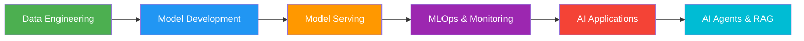
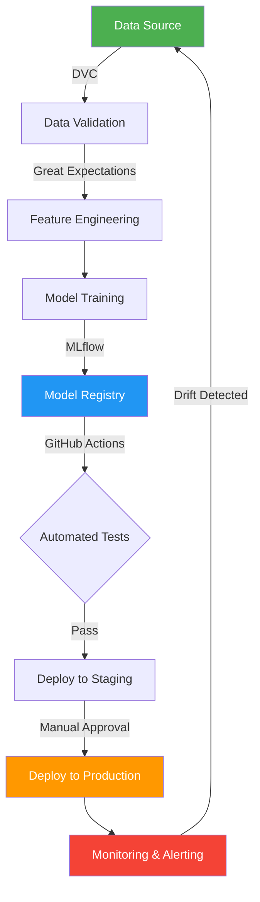
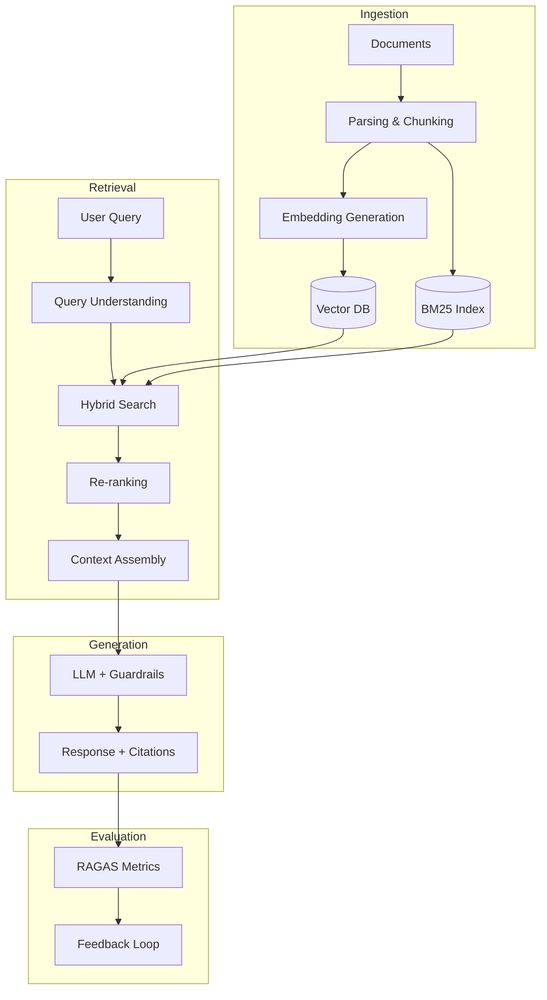
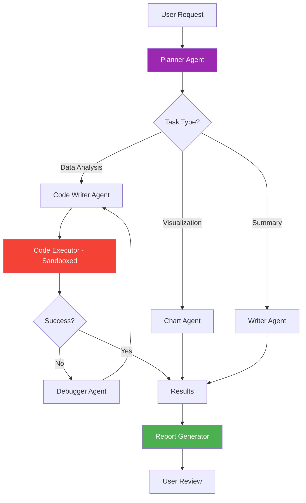
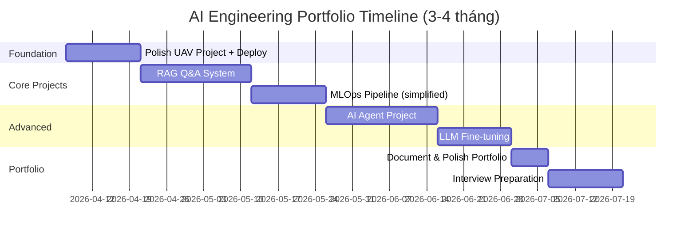

# 🚀 AI Engineering Fresher — Project Roadmap

> **Mục tiêu**: Xây dựng portfolio đủ mạnh để hiểu toàn bộ ngành AI Engineering và ứng tuyển vị trí Fresher/Junior.

## Tổng Quan Ngành AI Engineering



AI Engineering không chỉ là train model — nó là toàn bộ lifecycle từ **data → model → deployment → monitoring → iteration**. Dưới đây là 7 tầng dự án, mỗi tầng cover một khía cạnh quan trọng.

---

## Tier 1: 🧱 Classical ML — End-to-End Pipeline

> **Mục đích**: Chứng minh bạn hiểu fundamentals, không chỉ biết gọi `.fit()`

### Dự án: **Fraud Detection System**

| Hạng mục | Chi tiết |
|----------|---------|
| **Mô tả** | Xây dựng pipeline phát hiện giao dịch gian lận với imbalanced data |
| **Dataset** | [IEEE-CIS Fraud Detection](https://www.kaggle.com/c/ieee-fraud-detection) hoặc tự tạo synthetic data |
| **Tech Stack** | Python, Pandas, Scikit-learn, XGBoost/LightGBM, Optuna |
| **Key Skills** | EDA, Feature Engineering, Handling Imbalanced Data (SMOTE, class weights), Hyperparameter Tuning, Model Evaluation (Precision-Recall, AUC-ROC) |

### Checklist kỹ năng cần thể hiện:
- [ ] **Data Pipeline**: Thu thập → Làm sạch → Feature engineering tự động
- [ ] **Experiment Tracking**: Dùng MLflow hoặc Weights & Biases log toàn bộ experiments
- [ ] **Model Selection**: So sánh ≥3 algorithms với cross-validation
- [ ] **Evaluation đúng cách**: Không chỉ accuracy — phải có confusion matrix, PR curve, feature importance
- [ ] **Reproducibility**: `requirements.txt`, seed cố định, config file

> [!TIP]
> Đây là dự án "warm-up" nhưng cực kỳ quan trọng. Nhà tuyển dụng muốn thấy bạn hiểu **tại sao** chọn metric này, không chỉ **cách** code.

---

## Tier 2: 🧠 Deep Learning — Computer Vision

> **Mục đích**: Chứng minh bạn hiểu deep learning pipeline và transfer learning

### Dự án: **Multi-class Image Classification / Object Detection API**

| Hạng mục | Chi tiết |
|----------|---------|
| **Mô tả** | Xây dựng API phân loại ảnh hoặc object detection, deploy lên cloud |
| **Tech Stack** | PyTorch, torchvision, FastAPI, Docker |
| **Key Skills** | Transfer Learning (ResNet, EfficientNet), Data Augmentation, Learning Rate Scheduling, Model Export (ONNX/TorchScript) |

### Checklist kỹ năng cần thể hiện:
- [ ] **Training Pipeline**: Custom Dataset class, DataLoader, training loop
- [ ] **Transfer Learning**: Fine-tune pretrained model, freeze/unfreeze layers strategically
- [ ] **Optimization**: Mixed precision training, gradient accumulation
- [ ] **Serving**: Export model → ONNX → FastAPI endpoint → Docker container
- [ ] **Testing**: Unit tests cho data pipeline, integration tests cho API

> [!NOTE]
> Bạn đã có kinh nghiệm UAV semantic segmentation — có thể tận dụng project đó nhưng thêm phần **deployment** (FastAPI + Docker + cloud hosting) để hoàn thiện.

---

## Tier 3: 💬 NLP & LLM — Prompt Engineering to Fine-tuning

> **Mục đích**: Đây là **core skill** của AI Engineer 2024-2026. Phải thể hiện được cả prompt engineering lẫn fine-tuning.

### Dự án A: **Intelligent Document Q&A System** (Prompt Engineering + RAG)

| Hạng mục | Chi tiết |
|----------|---------|
| **Mô tả** | Upload PDF/document → Hỏi đáp bằng tiếng Việt với context awareness |
| **Tech Stack** | LangChain/LlamaIndex, OpenAI API / Gemini API, ChromaDB/Pinecone, Streamlit |
| **Key Skills** | Chunking strategies, Embedding models, Vector search, Prompt engineering, Chain-of-Thought |

### Dự án B: **Domain-Specific LLM Fine-tuning** (Advanced)

| Hạng mục | Chi tiết |
|----------|---------|
| **Mô tả** | Fine-tune một open-source LLM (Llama 3, Gemma, Qwen) cho task cụ thể (ví dụ: phân tích sentiment tiếng Việt, tóm tắt văn bản pháp luật) |
| **Tech Stack** | Hugging Face Transformers, PEFT/LoRA, QLoRA, bitsandbytes, Unsloth |
| **Key Skills** | LoRA/QLoRA fine-tuning, Dataset curation, Evaluation (BLEU, ROUGE, human eval), Quantization (GPTQ, AWQ) |

### Checklist kỹ năng cần thể hiện:
- [ ] **Prompt Engineering**: System prompts, few-shot, CoT, structured output
- [ ] **RAG Pipeline**: Document ingestion → Chunking → Embedding → Retrieval → Generation
- [ ] **Evaluation**: Không chỉ "chạy được" — phải có metrics (faithfulness, relevance, answer quality)
- [ ] **Fine-tuning**: LoRA config, training curves, before/after comparison
- [ ] **Cost Optimization**: Token usage tracking, caching strategies

> [!IMPORTANT]
> Bạn đã có kinh nghiệm IELTS grading với LLM — đây là lợi thế lớn! Hãy document lại project đó theo format chuyên nghiệp (README, architecture diagram, evaluation results).

---

## Tier 4: ⚙️ MLOps — Production-Grade Pipeline

> **Mục đích**: Đây là điểm khác biệt giữa "biết ML" và "làm được ML trong production"

### Dự án: **Automated ML Pipeline with CI/CD**

| Hạng mục | Chi tiết |
|----------|---------|
| **Mô tả** | Xây dựng pipeline tự động: data validation → training → evaluation → deployment → monitoring |
| **Tech Stack** | DVC, MLflow, GitHub Actions, Docker, Kubernetes (basic), Prometheus + Grafana |
| **Key Skills** | Data versioning, Model registry, A/B testing, Model monitoring, Drift detection |

### Architecture cần xây:



### Checklist kỹ năng cần thể hiện:
- [ ] **Version Control**: DVC cho data, Git cho code, MLflow cho models
- [ ] **CI/CD**: GitHub Actions tự động test + deploy khi push code
- [ ] **Containerization**: Dockerfile multi-stage, docker-compose cho local dev
- [ ] **Monitoring**: Track prediction distribution, latency, error rate
- [ ] **Infrastructure as Code**: Terraform hoặc Pulumi (bonus)

> [!TIP]
> Không cần setup Kubernetes cluster thật — dùng **Minikube** hoặc **Kind** local là đủ. Nhà tuyển dụng muốn thấy bạn **hiểu concepts**, không cần expert level.

---

## Tier 5: 🔍 RAG System — Production-Grade

> **Mục đích**: RAG là use case phổ biến nhất của AI Engineering hiện tại

### Dự án: **Enterprise Knowledge Base Chatbot**

| Hạng mục | Chi tiết |
|----------|---------|
| **Mô tả** | Chatbot tra cứu tài liệu nội bộ công ty với multi-modal support (text + tables + images) |
| **Tech Stack** | LangChain/LlamaIndex, pgvector/Qdrant, FastAPI, PostgreSQL, Redis |
| **Key Skills** | Advanced chunking, Hybrid search (dense + sparse), Re-ranking, Guardrails, Evaluation |

### Kiến trúc nâng cao cần implement:



### Checklist kỹ năng cần thể hiện:
- [ ] **Advanced Retrieval**: Hybrid search, multi-query, HyDE
- [ ] **Re-ranking**: Cross-encoder re-ranker (Cohere, BGE)
- [ ] **Guardrails**: Input/output validation, hallucination detection
- [ ] **Evaluation Framework**: RAGAS (faithfulness, relevance, context recall)
- [ ] **Caching**: Semantic cache với Redis để giảm latency & cost
- [ ] **Multi-tenancy**: Tách data giữa các users/organizations

---

## Tier 6: 🤖 AI Agents — Autonomous Systems

> **Mục đích**: AI Agents là tương lai của AI Engineering — thể hiện bạn hiểu xu hướng

### Dự án: **Multi-Tool AI Agent for Data Analysis**

| Hạng mục | Chi tiết |
|----------|---------|
| **Mô tả** | Agent tự động phân tích data: nhận CSV → tự viết code → chạy analysis → tạo report |
| **Tech Stack** | LangGraph/CrewAI/AutoGen, OpenAI/Gemini, Code Interpreter, Streamlit |
| **Key Skills** | Tool calling, Memory management, Planning & reasoning, Error recovery, Human-in-the-loop |

### Agent Architecture:



### Checklist kỹ năng cần thể hiện:
- [ ] **Tool Use**: Function calling, API integration
- [ ] **State Management**: Conversation memory, task progress tracking
- [ ] **Error Handling**: Graceful fallback, retry logic, human escalation
- [ ] **Safety**: Sandboxed code execution, output validation
- [ ] **Observability**: LangSmith/Langfuse tracing cho debug

---

## Tier 7: 🏆 Capstone — Full-Stack AI Product

> **Mục đích**: Kết hợp TẤT CẢ skills trên thành một sản phẩm hoàn chỉnh

### Dự án: **AI-Powered SaaS Application**

Chọn **một** trong các ý tưởng sau:

| Ý tưởng | Mô tả | Điểm nổi bật |
|----------|-------|--------------|
| **AI Resume Screener** | Upload JD + CVs → AI đánh giá & ranking ứng viên | RAG + Structured Output + Dashboard |
| **AI Code Reviewer** | Kết nối GitHub → Auto review PR với context | Agent + Tool calling + Git API |
| **AI Study Assistant** | Upload bài giảng → Tạo flashcards, quiz, summary tự động | Multi-modal + RAG + Gamification |
| **AI Customer Support** | Chatbot tự trả lời FAQ, escalate to human khi cần | RAG + Agent + Human-in-the-loop |

### Tech Stack đầy đủ:

```
Frontend:     Next.js / React + TailwindCSS
Backend:      FastAPI / Node.js
Database:     PostgreSQL + pgvector (Supabase)
AI:           OpenAI / Gemini API + LangChain
Auth:         Supabase Auth / NextAuth
Deployment:   Docker + Cloud Run / Vercel
Monitoring:   Langfuse + Prometheus
CI/CD:        GitHub Actions
```

### Checklist kỹ năng cần thể hiện:
- [ ] **Full-Stack**: Frontend + Backend + Database + AI
- [ ] **Authentication**: User management, API key rotation
- [ ] **Rate Limiting**: Protect API from abuse
- [ ] **Cost Management**: Token tracking, usage quotas per user
- [ ] **Scalability**: Async processing, queue system (Celery/BullMQ)
- [ ] **Documentation**: API docs (Swagger), README, Architecture Decision Records

---

## 📋 Tổng Kết: Minimum Viable Portfolio

> [!IMPORTANT]
> Bạn **KHÔNG CẦN** làm hết 7 tiers. Đây là priority order cho **Fresher AI Engineer**:

### Must-Have (Bắt buộc) ⭐

| # | Project | Lý do |
|---|---------|-------|
| 1 | **Tier 3A: RAG Q&A System** | Đây là use case phổ biến nhất, gần như mọi công ty AI đều cần |
| 2 | **Tier 2: Deep Learning + Deployment** | Chứng minh bạn biết train + deploy model (bạn đã có UAV project!) |
| 3 | **Tier 4: MLOps Pipeline (simplified)** | Docker + CI/CD + experiment tracking — đủ để differentiate |

### Should-Have (Nên có) 📌

| # | Project | Lý do |
|---|---------|-------|
| 4 | **Tier 6: AI Agent** | Hot trend, thể hiện bạn theo kịp xu hướng |
| 5 | **Tier 3B: LLM Fine-tuning** | Hiểu sâu hơn về LLM internals |

### Nice-to-Have (Bonus) 🎁

| # | Project | Lý do |
|---|---------|-------|
| 6 | **Tier 7: Full-Stack AI Product** | Game changer nếu có, nhưng tốn nhiều thời gian |
| 7 | **Tier 1: Classical ML** | Có thể skip nếu đã qua courses |

---

## 🛠️ Kỹ Năng Nền Tảng (Phải có song song)

Ngoài projects, bạn cần **chắc chắn** về:

| Category | Skills | Resources |
|----------|--------|-----------|
| **Python** | OOP, async/await, type hints, testing | Real Python, Python docs |
| **Git** | Branching, PR workflow, conventional commits | Bạn đã setup conventions! |
| **Docker** | Dockerfile, docker-compose, multi-stage builds | Docker official tutorial |
| **SQL** | Joins, window functions, query optimization | Mode Analytics SQL tutorial |
| **Linux** | CLI basics, SSH, cron, systemd | Linux Journey |
| **Cloud** | GCP/AWS basics (1 cloud is enough) | Free tier + documentation |
| **API Design** | REST, authentication, error handling, versioning | FastAPI docs |

---

## 📊 Timeline Gợi Ý



---

## 📝 Tips Trình Bày Portfolio

1. **GitHub README chuyên nghiệp**: Architecture diagram, demo GIF, clear setup instructions
2. **Live Demo**: Deploy ít nhất 1-2 projects lên cloud (Streamlit Cloud, Hugging Face Spaces, Cloud Run)
3. **Blog/Write-up**: Viết 2-3 bài technical blog về lessons learned (Medium, dev.to, hoặc personal blog)
4. **Video Demo**: Record 2-3 phút demo cho mỗi project — nhiều recruiter prefer video

> [!CAUTION]
> **Đừng chỉ fork + chạy tutorial!** Nhà tuyển dụng dễ dàng nhận ra. Hãy thêm twist riêng: dùng dataset khác, thêm feature mới, giải quyết edge case thực tế.

---

## 🎯 Lợi Thế Hiện Tại Của Bạn

Từ các dự án bạn đã làm, bạn có nền tảng rất tốt:

| Dự án đã có | Skills đã chứng minh | Cần bổ sung |
|-------------|----------------------|-------------|
| **UAV Semantic Segmentation** | PyTorch, Transfer Learning, Experiment Design | Deployment (API + Docker), MLOps |
| **IELTS Grading System** | Prompt Engineering, LLM API, Evaluation Pipeline | RAG, Fine-tuning, UI |
| **LaTeX Research Pipeline** | Documentation, Reproducibility | — |
| **Conventional Commits** | Engineering best practices | — |

> [!TIP]
> Bạn chỉ cần **1-2 projects mới** + **polish 2 projects hiện tại** là đã có portfolio cực mạnh cho Fresher position!
